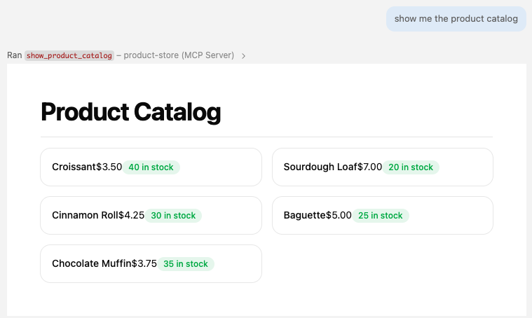

# Exercise 4: Add Advanced Features to Your MCP Server

In this exercise, you'll add a visual UI to your store server from Exercise 3 using [Prefab UI](https://gofastmcp.com/apps/prefab) — an interactive component library for FastMCP apps. Instead of returning plain text, your tools will render charts, tables, and cards directly in the host's conversation.

- [Step 1: Add an inventory dashboard tool](#step-1-add-an-inventory-dashboard-tool)
- [Step 2: Product catalog with cards](#step-2-product-catalog-with-cards)
- [Step 3: Purchase confirmation with elicitation](#step-3-purchase-confirmation-with-elicitation)
- [Further reading](#further-reading)

---

## Step 1: Add an inventory dashboard tool

Add a new tool to your `servers/store_server.py` that shows inventory levels as a bar chart. Add these imports at the top of your file:

```python
from prefab_ui.app import PrefabApp
from prefab_ui.components import Column, Heading
from prefab_ui.components.charts import BarChart, ChartSeries
```

Then add this tool — fill in the TODO to build the chart data from your `INVENTORY`:

```python
@mcp.tool(app=True)
def show_inventory_chart() -> PrefabApp:
    """Show current inventory levels as an interactive bar chart."""

    # TODO: Build a list of dicts from INVENTORY for the chart.
    # Each dict needs a "product" key (the name) and a "quantity" key.
    # Example: [{"product": "Croissant", "quantity": 40}, ...]
    data = []

    with Column(gap=4, css_class="p-6") as view:
        Heading("Inventory Levels")
        BarChart(
            data=data,
            series=[ChartSeries(data_key="quantity", label="In Stock")],
            x_axis="product",
        )

    return PrefabApp(view=view)
```

The key change: `@mcp.tool(app=True)` tells FastMCP this tool returns a UI. The host renders an interactive chart instead of a text blob.

Restart your server and ask your coding agent:

> "Show me the inventory chart"

You should see an interactive bar chart rendered inline in the conversation:


Try buying a product first, then viewing the chart again to see the updated quantities.

---

## Step 2: Product catalog with cards

Add a tool that displays your products as styled cards with prices and stock badges. Add these extra imports:

```python
from prefab_ui.components import Row, Grid, Card, CardContent, Text, Badge, Separator
```

Then add the tool:

```python
@mcp.tool(app=True)
def show_product_catalog() -> PrefabApp:
    """Show the product catalog as a visual card layout."""

    with Column(gap=4, css_class="p-6") as view:
        Heading("Product Catalog")
        Separator()
        with Grid(columns=2, gap=4):
            for name, info in INVENTORY.items():
                with Card():
                    with CardContent():
                        Text(name, css_class="font-medium")
                        # TODO: Add a Text component showing the price
                        # TODO: Add a Badge showing stock status
                        #   e.g. "In Stock" (variant="success") or
                        #        "Out of Stock" (variant="destructive")

    return PrefabApp(view=view)
```

Restart your server and ask your coding agent:

> "Show me the product catalog"

You should see a card grid with your products, prices, and stock badges:



---

## Step 3: Purchase confirmation with elicitation

Instead of buying immediately, have the server ask the user to confirm the purchase. This uses [elicitation](https://gofastmcp.com/clients/elicitation) — a way for the server to request structured input from the user mid-operation.

Update your `buy_product` tool to use the `Context` object for elicitation. Add these imports:

```python
from fastmcp import Context
from pydantic import BaseModel, Field
```

Define a response model for the confirmation dialog:

```python
class PurchaseConfirmation(BaseModel):
    confirm: bool = Field(title="Confirm purchase", description="Approve this transaction?")
```

Then modify `buy_product` to accept a `ctx: Context` parameter and ask for confirmation before completing the purchase:

```python
@mcp.tool
async def buy_product(
    product_name: Annotated[str, "Name of the product to buy"],
    quantity: Annotated[int, "Number of items to buy"],
    ctx: Context,
) -> str:
    """Buy a product from the store, with user confirmation."""
    if product_name not in INVENTORY:
        return f"Error: '{product_name}' not found."

    product = INVENTORY[product_name]
    total = product["price"] * quantity

    # Ask the user to confirm before purchasing
    response = await ctx.elicit(
        message=f"Buy {quantity}x {product_name} for ${total:.2f}?",
        response_type=PurchaseConfirmation,
    )

    if response.action != "accept" or not response.data.confirm:
        return "Purchase cancelled."

    # TODO: Complete the purchase (check stock, reduce quantity, return success)
```

When this tool runs, the host will display a confirmation dialog. The user can accept, decline, or cancel — and the tool continues based on their choice.

---

## Further reading

- [MCP Apps overview](https://gofastmcp.com/apps/overview) — Three other ways to build apps (FastMCPApp, Generative UI, custom HTML)
- [Prefab UI docs](https://gofastmcp.com/apps/prefab) — Full component reference (charts, tables, forms, state, reactivity)
- [Prefab patterns](https://gofastmcp.com/apps/patterns) — Dashboards, data tables, and more examples
- [Elicitation](https://gofastmcp.com/clients/elicitation) — Server-initiated user input requests
- [Background tasks](https://gofastmcp.com/servers/tasks) — Run long operations asynchronously with progress reporting
