## Slide 1

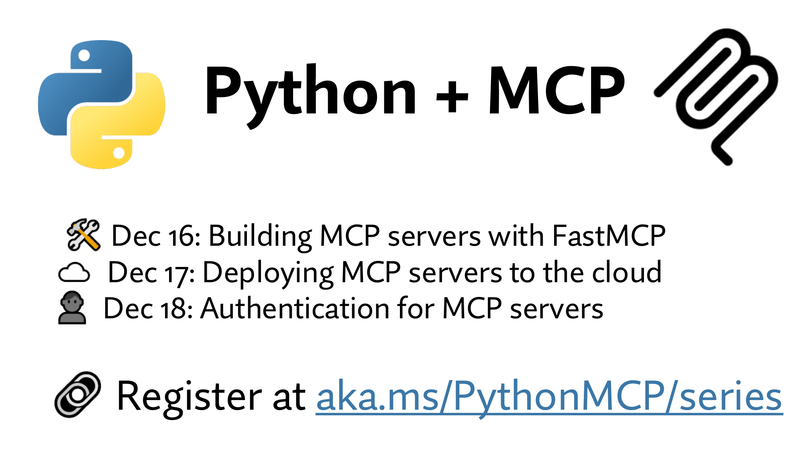

```
Python + MCP
Dec 16: Building MCP servers with FastMCP
Dec 17: Deploying MCP servers to the cloud
Dec 18: Authentication for MCP servers


Register at aka.ms/PythonMCP/series
```

## Slide 2

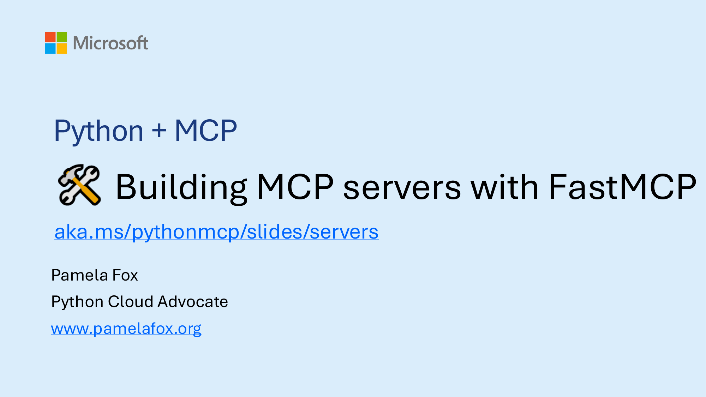

```
Python + MCP
       Building MCP servers with FastMCP
aka.ms/pythonmcp/slides/servers
Pamela Fox
Python Cloud Advocate
www.pamelafox.org
```

## Slide 3

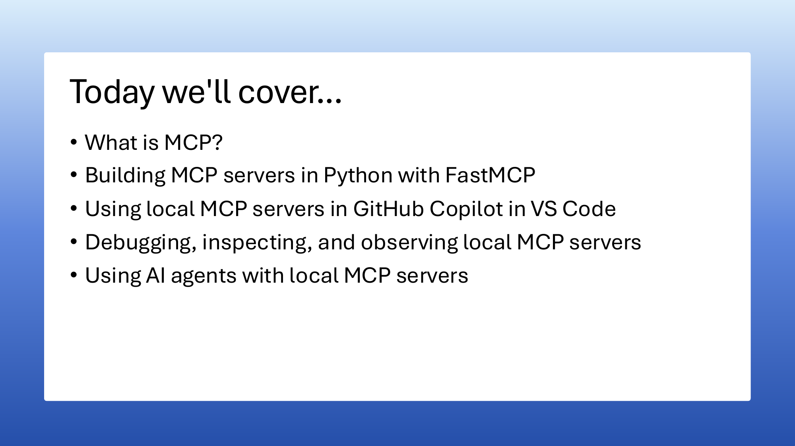

```
Today we'll cover...
• What is MCP?
• Building MCP servers in Python with FastMCP
• Using local MCP servers in GitHub Copilot in VS Code
• Debugging, inspecting, and observing local MCP servers
• Using AI agents with local MCP servers
```

## Slide 4

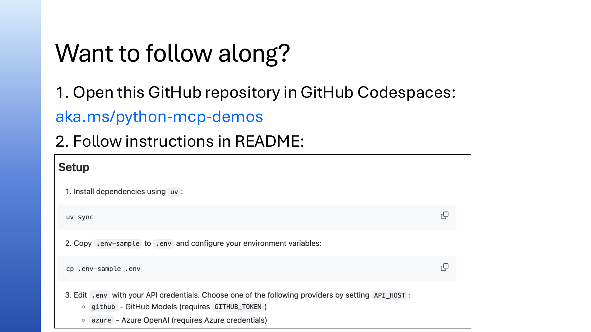

```
Want to follow along?
1. Open this GitHub repository in GitHub Codespaces:
aka.ms/python-mcp-demos
2. Follow instructions in README:
```

## Slide 5


```
What is MCP?
```

## Slide 6

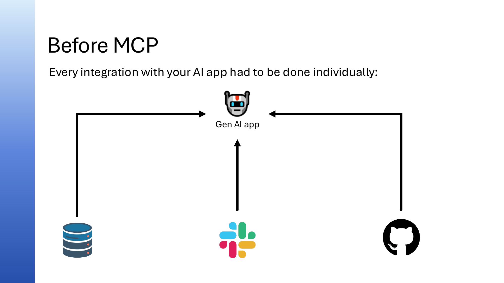

```
Before MCP
Every integration with your AI app had to be done individually:


                               Gen AI app
```

## Slide 7

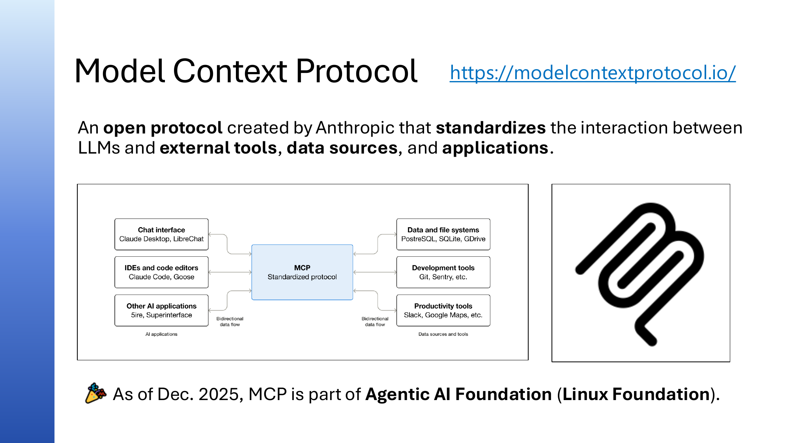

```
Model Context Protocol                      https://modelcontextprotocol.io/

An open protocol created by Anthropic that standardizes the interaction between
LLMs and external tools, data sources, and applications.


    As of Dec. 2025, MCP is part of Agentic AI Foundation (Linux Foundation).
```

## Slide 8

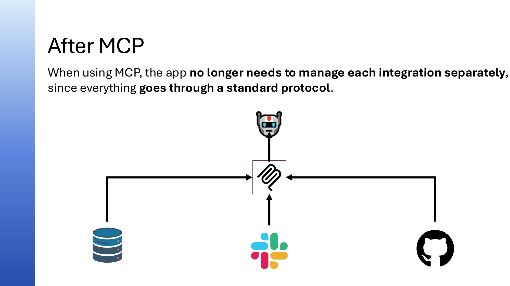

```
After MCP
When using MCP, the app no longer needs to manage each integration separately,
since everything goes through a standard protocol.
```

## Slide 9

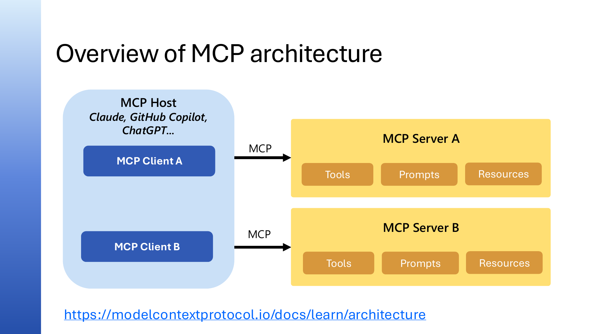

```
Overview of MCP architecture
         MCP Host
   Claude, GitHub Copilot,
         ChatGPT...
                                                MCP Server A
                             MCP
        MCP Client A
                                       Tools      Prompts      Resources


                                                MCP Server B
                             MCP
       MCP Client B
                                       Tools       Prompts     Resources


https://modelcontextprotocol.io/docs/learn/architecture
```

## Slide 10

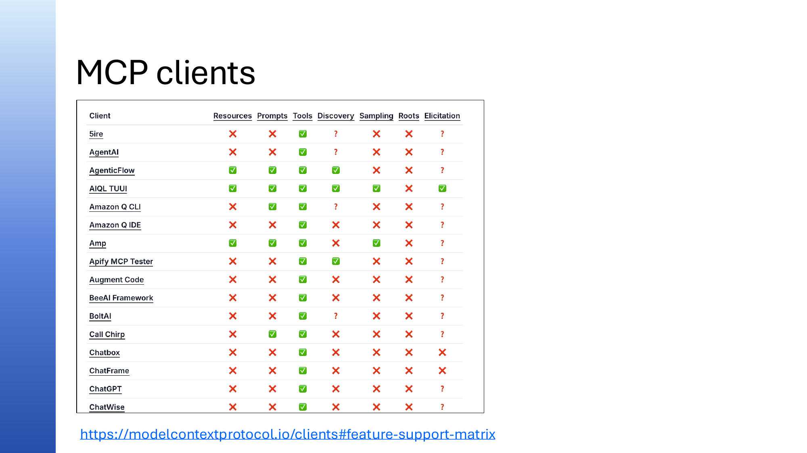

```
MCP clients


https://modelcontextprotocol.io/clients#feature-support-matrix
```

## Slide 11

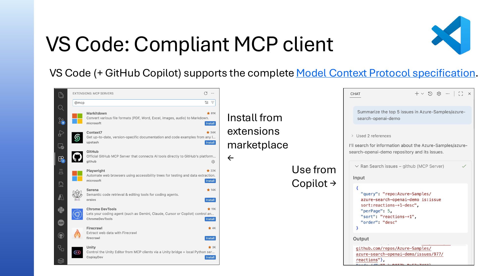

```
VS Code: Compliant MCP client
VS Code (+ GitHub Copilot) supports the complete Model Context Protocol specification.


                                   Install from
                                   extensions
                                   marketplace
                                   ←
                                                  Use from
                                                  Copilot →
```

## Slide 12

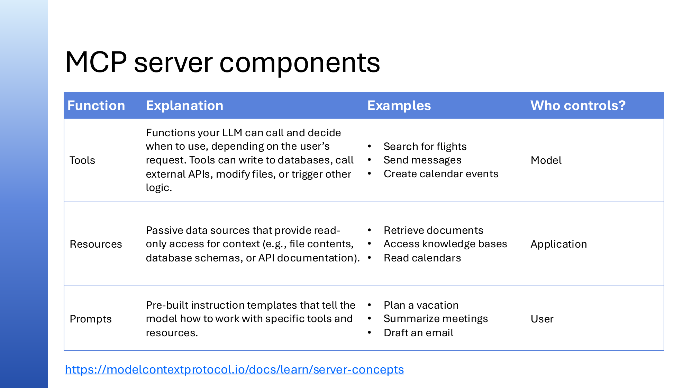

```
MCP server components
Function     Explanation                                     Examples                     Who controls?
             Functions your LLM can call and decide
             when to use, depending on the user’s            •   Search for flights
Tools        request. Tools can write to databases, call     •   Send messages            Model
             external APIs, modify files, or trigger other   •   Create calendar events
             logic.


             Passive data sources that provide read-       •     Retrieve documents
Resources    only access for context (e.g., file contents, •     Access knowledge bases   Application
             database schemas, or API documentation). •          Read calendars


             Pre-built instruction templates that tell the   •   Plan a vacation
Prompts      model how to work with specific tools and       •   Summarize meetings       User
             resources.                                      •   Draft an email


https://modelcontextprotocol.io/docs/learn/server-concepts
```

## Slide 13

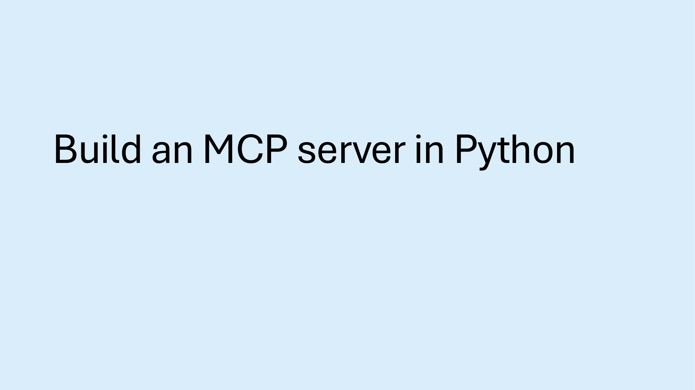

```
Build an MCP server in Python
```

## Slide 14

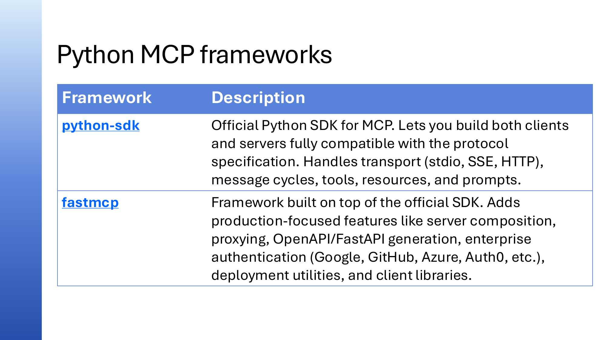

```
Python MCP frameworks
Framework    Description
python-sdk   Official Python SDK for MCP. Lets you build both clients
             and servers fully compatible with the protocol
             specification. Handles transport (stdio, SSE, HTTP),
             message cycles, tools, resources, and prompts.
fastmcp      Framework built on top of the official SDK. Adds
             production-focused features like server composition,
             proxying, OpenAPI/FastAPI generation, enterprise
             authentication (Google, GitHub, Azure, Auth0, etc.),
             deployment utilities, and client libraries.
```

## Slide 15

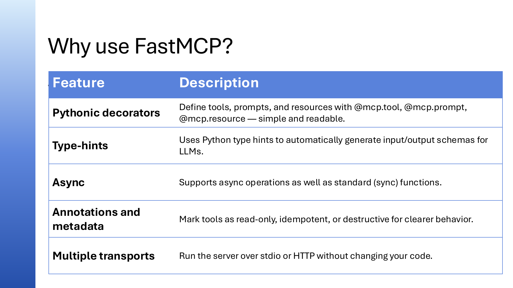

```
Why use FastMCP?
Feature             Description
We'll be experimenting with these frameworks today:
                      Define tools, prompts, and resources with @mcp.tool, @mcp.prompt,
Pythonic decorators   @mcp.resource — simple and readable.

                      Uses Python type hints to automatically generate input/output schemas for
Type-hints            LLMs.


Async                 Supports async operations as well as standard (sync) functions.


Annotations and
                      Mark tools as read-only, idempotent, or destructive for clearer behavior.
metadata

Multiple transports   Run the server over stdio or HTTP without changing your code.
```

## Slide 16

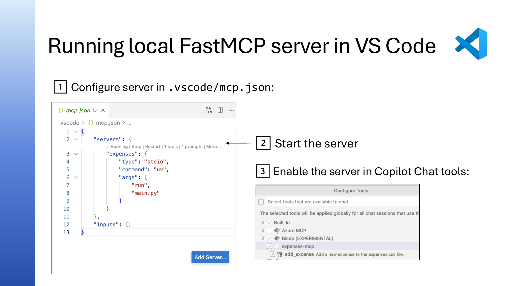

```
Running local FastMCP server in VS Code
1️⃣ Configure server in .vscode/mcp.json:


                                     2️⃣ Start the server

                                     3️⃣ Enable the server in Copilot Chat tools:
```

## Slide 17

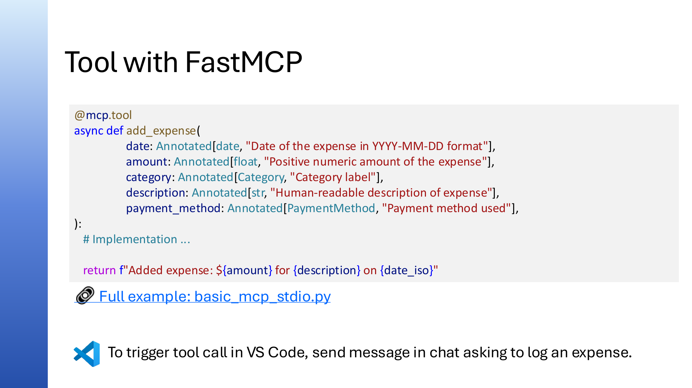

```
Tool with FastMCP
@mcp.tool
async def add_expense(
          date: Annotated[date, "Date of the expense in YYYY-MM-DD format"],
          amount: Annotated[float, "Positive numeric amount of the expense"],
          category: Annotated[Category, "Category label"],
          description: Annotated[str, "Human-readable description of expense"],
          payment_method: Annotated[PaymentMethod, "Payment method used"],
):
   # Implementation ...

 return f"Added expense: ${amount} for {description} on {date_iso}"

    Full example: basic_mcp_stdio.py


      To trigger tool call in VS Code, send message in chat asking to log an expense.
```

## Slide 18

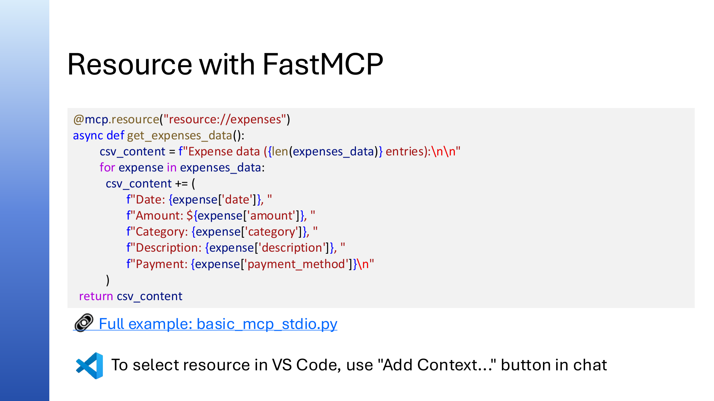

```
Resource with FastMCP
@mcp.resource("resource://expenses")
async def get_expenses_data():
     csv_content = f"Expense data ({len(expenses_data)} entries):\n\n"
     for expense in expenses_data:
      csv_content += (
          f"Date: {expense['date']}, "
          f"Amount: ${expense['amount']}, "
          f"Category: {expense['category']}, "
          f"Description: {expense['description']}, "
          f"Payment: {expense['payment_method']}\n"
      )
 return csv_content

    Full example: basic_mcp_stdio.py

      To select resource in VS Code, use "Add Context..." button in chat
```

## Slide 19

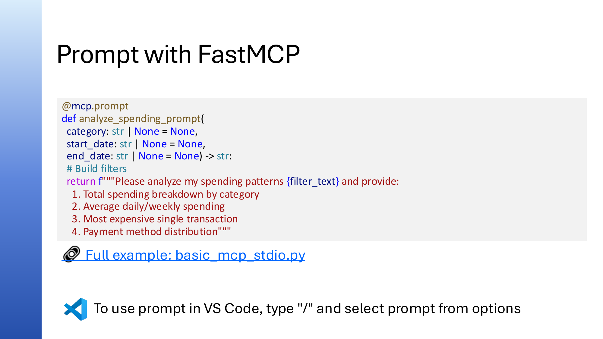

```
Prompt with FastMCP
@mcp.prompt
def analyze_spending_prompt(
 category: str | None = None,
 start_date: str | None = None,
 end_date: str | None = None) -> str:
 # Build filters
 return f"""Please analyze my spending patterns {filter_text} and provide:
  1. Total spending breakdown by category
  2. Average daily/weekly spending
  3. Most expensive single transaction
  4. Payment method distribution"""

     Full example: basic_mcp_stdio.py


       To use prompt in VS Code, type "/" and select prompt from options
```

## Slide 20

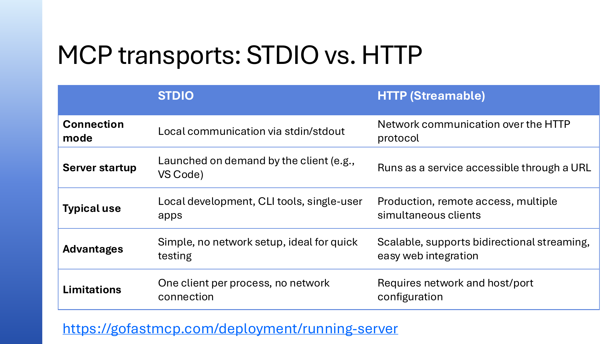

```
MCP transports: STDIO vs. HTTP
                 STDIO                                       HTTP (Streamable)

Connection                                                   Network communication over the HTTP
                 Local communication via stdin/stdout
mode                                                         protocol
                 Launched on demand by the client (e.g.,
Server startup                                               Runs as a service accessible through a URL
                 VS Code)

                 Local development, CLI tools, single-user   Production, remote access, multiple
Typical use
                 apps                                        simultaneous clients

                 Simple, no network setup, ideal for quick   Scalable, supports bidirectional streaming,
Advantages
                 testing                                     easy web integration

                 One client per process, no network          Requires network and host/port
Limitations
                 connection                                  configuration

https://gofastmcp.com/deployment/running-server
```

## Slide 21

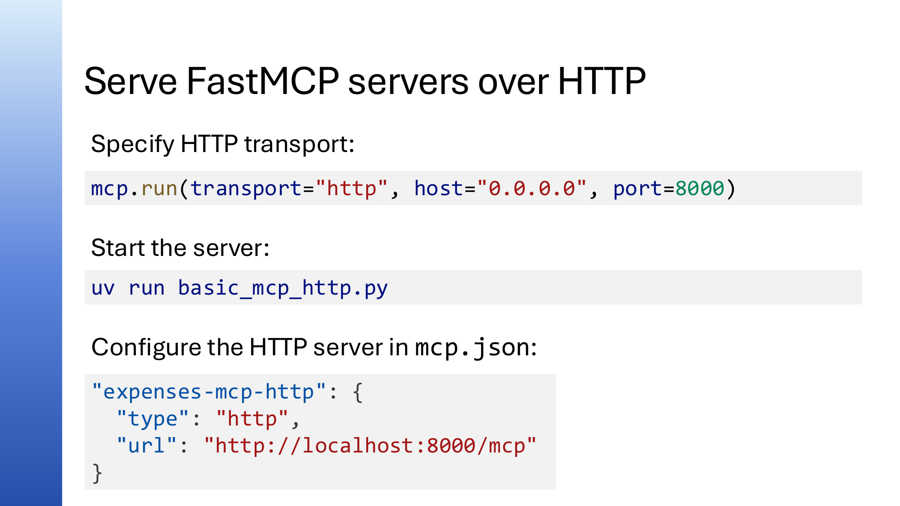

```
Serve FastMCP servers over HTTP
Specify HTTP transport:
mcp.run(transport="http", host="0.0.0.0", port=8000)

Start the server:
uv run basic_mcp_http.py

Configure the HTTP server in mcp.json:
"expenses-mcp-http": {
  "type": "http",
  "url": "http://localhost:8000/mcp"
}
```

## Slide 22

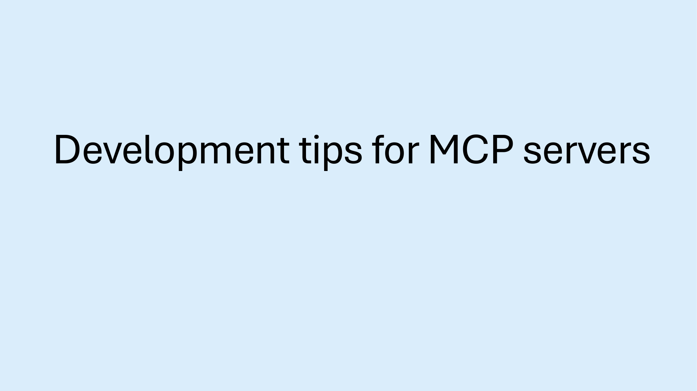

```
Development tips for MCP servers
```

## Slide 23

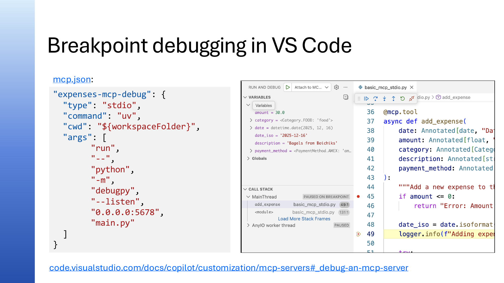

```
Breakpoint debugging in VS Code
mcp.json:
"expenses-mcp-debug": {
  "type": "stdio",
  "command": "uv",
  "cwd": "${workspaceFolder}",
  "args": [
        "run",
        "--",
        "python",
        "-m",
        "debugpy",
        "--listen",
        "0.0.0.0:5678",
        "main.py"
  ]
}

code.visualstudio.com/docs/copilot/customization/mcp-servers#_debug-an-mcp-server
```

## Slide 24

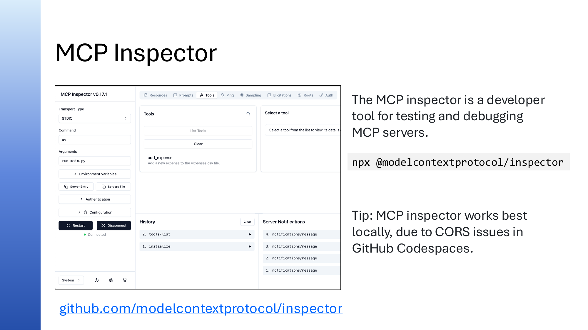

```
MCP Inspector
                                            The MCP inspector is a developer
                                            tool for testing and debugging
                                            MCP servers.

                                            npx @modelcontextprotocol/inspector


                                            Tip: MCP inspector works best
                                            locally, due to CORS issues in
                                            GitHub Codespaces.


github.com/modelcontextprotocol/inspector
```

## Slide 25

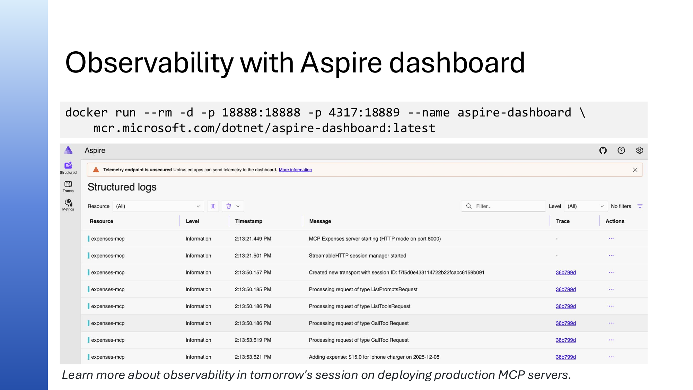

```
Observability with Aspire dashboard
docker run --rm -d -p 18888:18888 -p 4317:18889 --name aspire-dashboard \
    mcr.microsoft.com/dotnet/aspire-dashboard:latest


Learn more about observability in tomorrow's session on deploying production MCP servers.
```

## Slide 26

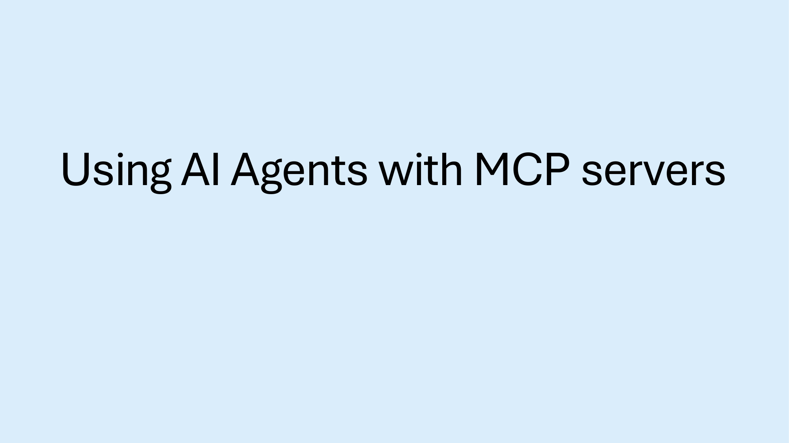

```
Using AI Agents with MCP servers
```

## Slide 27

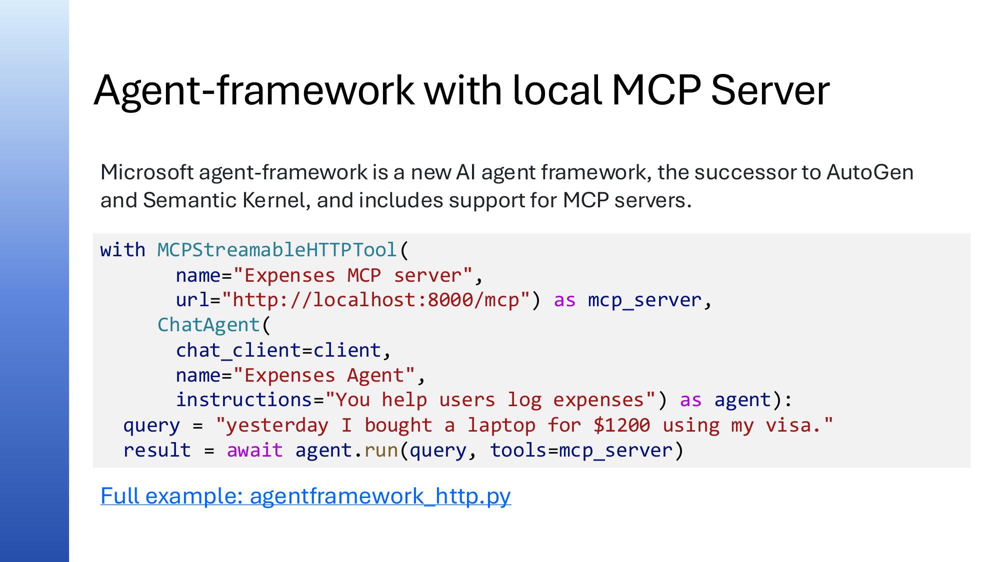

```
Agent-framework with local MCP Server
Microsoft agent-framework is a new AI agent framework, the successor to AutoGen
and Semantic Kernel, and includes support for MCP servers.

with MCPStreamableHTTPTool(
       name="Expenses MCP server",
       url="http://localhost:8000/mcp") as mcp_server,
     ChatAgent(
       chat_client=client,
       name="Expenses Agent",
       instructions="You help users log expenses") as agent):
  query = "yesterday I bought a laptop for $1200 using my visa."
  result = await agent.run(query, tools=mcp_server)

Full example: agentframework_http.py
```

## Slide 28

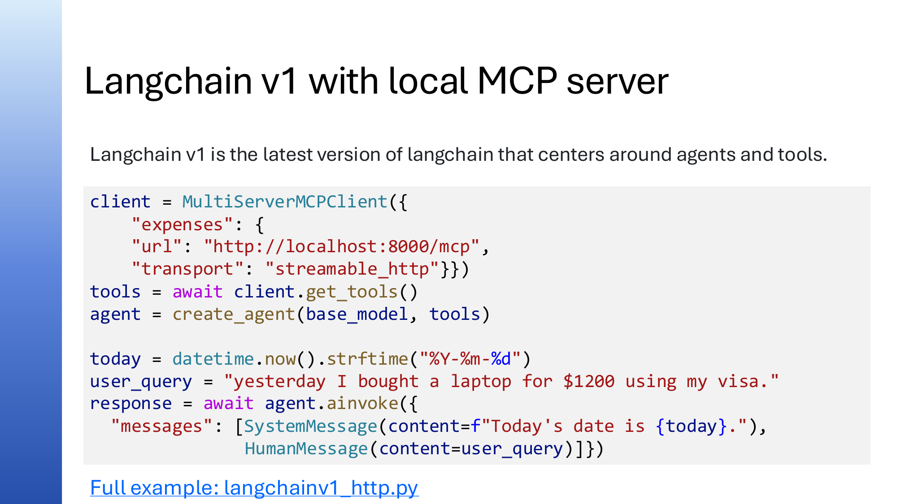

```
Langchain v1 with local MCP server
Langchain v1 is the latest version of langchain that centers around agents and tools.

client = MultiServerMCPClient({
    "expenses": {
    "url": "http://localhost:8000/mcp",
    "transport": "streamable_http"}})
tools = await client.get_tools()
agent = create_agent(base_model, tools)

today = datetime.now().strftime("%Y-%m-%d")
user_query = "yesterday I bought a laptop for $1200 using my visa."
response = await agent.ainvoke({
  "messages": [SystemMessage(content=f"Today's date is {today}."),
               HumanMessage(content=user_query)]})

Full example: langchainv1_http.py
```

## Slide 29

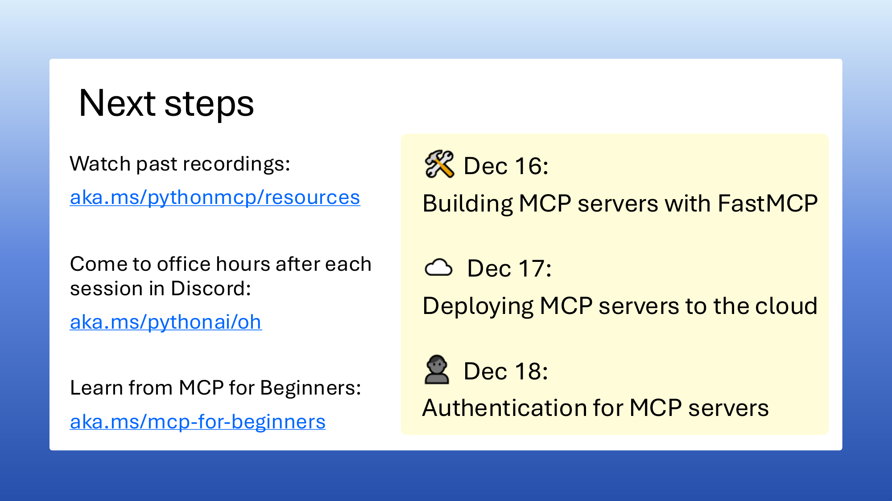

```
Next steps
Watch past recordings:                Dec 16:
aka.ms/pythonmcp/resources        Building MCP servers with FastMCP

Come to office hours after each      Dec 17:
session in Discord:
                                  Deploying MCP servers to the cloud
aka.ms/pythonai/oh

                                     Dec 18:
Learn from MCP for Beginners:
aka.ms/mcp-for-beginners
                                  Authentication for MCP servers
```
