## Slide 1

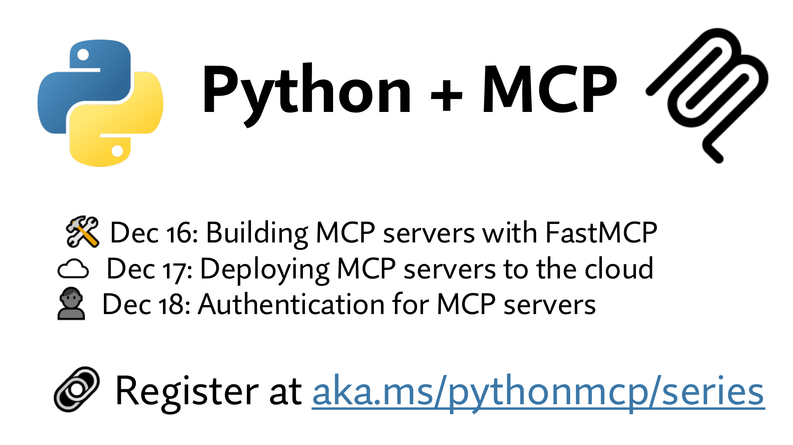

```
Python + MCP
Dec 16: Building MCP servers with FastMCP
Dec 17: Deploying MCP servers to the cloud
Dec 18: Authentication for MCP servers


Register at aka.ms/pythonmcp/series
```

## Slide 2

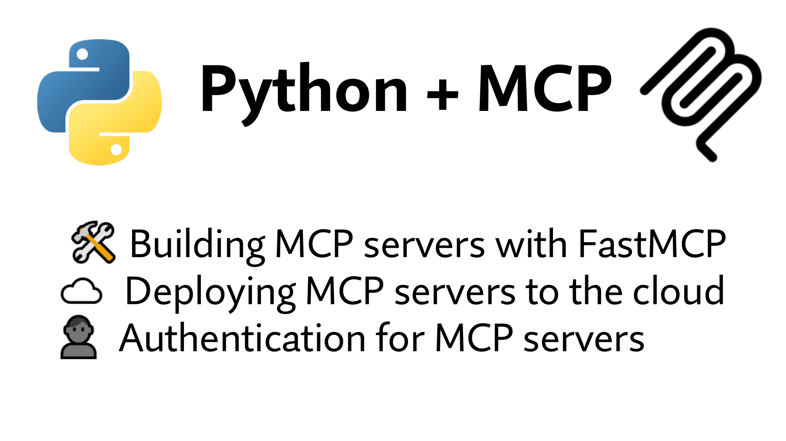

```
Python + MCP

Building MCP servers with FastMCP
Deploying MCP servers to the cloud
Authentication for MCP servers
```

## Slide 3

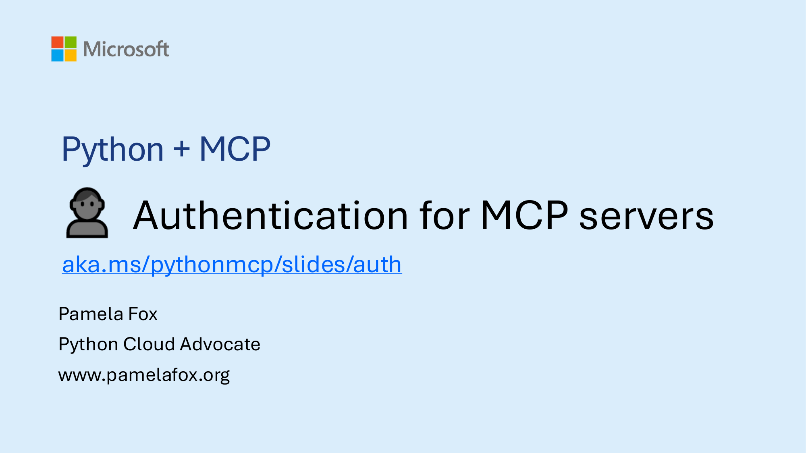

```
Python + MCP
       Authentication for MCP servers
aka.ms/pythonmcp/slides/auth
Pamela Fox
Python Cloud Advocate
www.pamelafox.org
```

## Slide 4

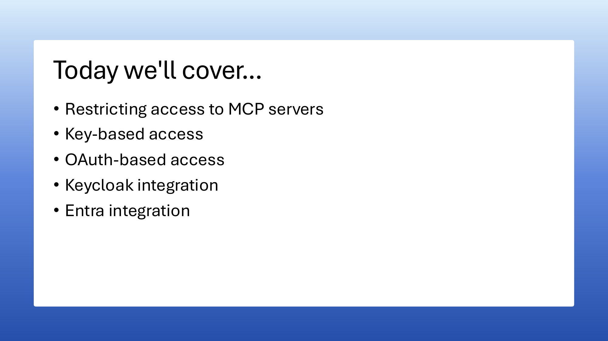

```
Today we'll cover...
• Restricting access to MCP servers
• Key-based access
• OAuth-based access
• Keycloak integration
• Entra integration
```

## Slide 5


```
Restricting MCP server access
```

## Slide 6


```
Recap: MCP architecture
                                               MCP Server A
                           MCP
      MCP Client A
                                      Tools       Prompts     Resources


                                               MCP Server B
                           MCP
      MCP Client B
                                       Tools      Prompts     Resources


MCP clients may be inside desktop applications like VS Code/Claude Code,
or from programmatic AI agents written with frameworks like Langchain.
```

## Slide 7


```
Restricting access to MCP servers
These are the three primary approaches:


    Private network                    Key-based access               OAuth-based access

                       Virtual
                      Network
                                                      MCP server       User      MCP server       Auth server
    MCP server


Access is allowed only within        Access is granted with keys    Access is granted based on OAuth2
the restricted private network,      that are registered with the   flow between user, MCP client,
or over VPN gateways into it.        MCP server.                    authentication provider, and MCP
                                                                    server.
Discussed in the 12/17 livestream.          Discussing today!                 Discussing today!
```

## Slide 8

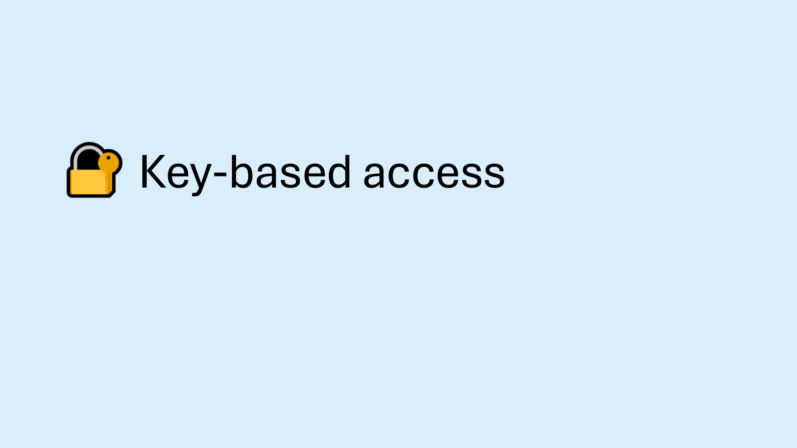

```
Key-based access
```

## Slide 9


```
Key-based access flow
A key is often specified in headers or URL query parameters:
                       MCP

                       POST /mcp
                       api-key: abc123key
                       content-type: application/json

   MCP Client          mcp-session-id: a123
                       ....
                                                                  MCP Server
                       { "jsonrpc": "2.0",
                         "id": 1,
                         "method": "tools/list"}


                                 {"jsonrpc":"2.0",
                                  "id":4,                        The server verifies
                                  "result": {
                                    "tools":[{
                                                                 the key is valid.
                                       "name": "name_of_tool",
                                       ...}]}}
```

## Slide 10


```
Specifying a key for MCP server in VS Code
The Tavily MCP server supports key-based access:
{"servers": {
  "tavily-mcp": {
   "url": "https://mcp.tavily.com/mcp/",
   "type": "http",
   "headers": {
     "Authorization": "Bearer ${input:tavily-key}"
     }                                                        VS Code lets you
   }}},                                                       designate keys as
 "inputs": [{                                                 "password" inputs to
   "type": "promptString",                                    reduce risk of exposure.
   "id": "tavily-key",
   "description": "Tavily MCP API Key",
   "password": true
  }]
}

https://docs.tavily.com/documentation/mcp#remote-mcp-server
```

## Slide 11


```
Specifying a key for MCP server in an AI agent
AI agent frameworks provide ways to customize the URL and headers.
agent-framework:
MCPStreamableHTTPTool(
  name="Tavily MCP",
  url="https://mcp.tavily.com/mcp/",
  headers={"Authorization": f"Bearer {tavily_key}"}
)

  aka.ms/python-mcp-demos: agents/agentframework_tavily.py

langchain:
MultiServerMCPClient({
  "tavily": {
    "url": "https://mcp.tavily.com/mcp/",
    "transport": "streamable_http",
    "headers": {"Authorization": f"Bearer {tavily_key}"}}})

  aka.ms/python-mcp-demos: agents/langchainv1_tavily.py
```

## Slide 12


```
Deploying key-based access in Azure
      Azure Functions                Azure API Management


                                                                    ...or build your
                                                                        own key
                                                                     management
                                                                        system.

 Azure Functions offers a basic        APIM offers an API key
   key-based access option.          management system and
  Most useful for internal tools         developer portal.
      with limited users.          Scalable and production ready.
```

## Slide 13


```
Deploying Azure Function with key access
1. Open this GitHub repository:
 https://github.com/Azure-Samples/mcp-sdk-functions-hosting-python


2. Change "DefaultAuthorizationLevel" to "function" in host.json

3. Deploy with Azure Developer CLI:
   >> azd auth login
   >> azd env set ANONYMOUS_SERVER_AUTH true

   >> azd up
```

## Slide 14


```
Demo: Using deployed function from VS Code
.vscode/mcp.json:
{"servers": {
  "deployed-mcp-server": {
    "url": "https://your-function-subdomain.azurewebsites.net/mcp",
    "type": "http",
    "headers": {
      "x-functions-key": "${input:functionapp-key}"
  }}},
 "inputs": [{
    "type": "promptString",
    "id": "functionapp-key",
    "description": "Server key",
    "password": true
}]}
```

## Slide 15

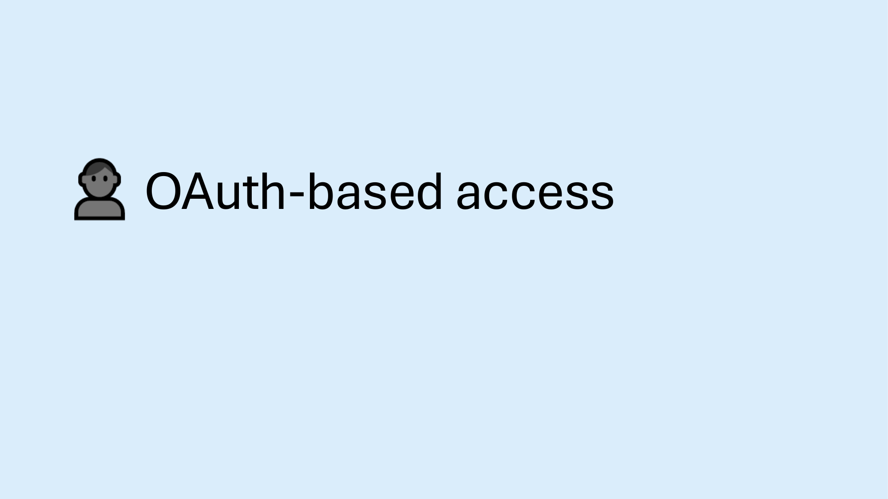

```
OAuth-based access
```

## Slide 16


```
OAuth-based access flow
MCP client can make requests to MCP servers on behalf of users:
                            MCP

                            POST /mcp
                            Bearer: Authorization access-token

                            { "jsonrpc": "2.0",
                                                                                     MCP Server
    MCP Client                "method": "tools/call",
                              "params": {
                                 "name": "get_expenses",
                                 "arguments": {
                                   "user_id": "abc123"}}


                                        {"jsonrpc":"2.0",
                                         "result": {                           The server verifies
                                           "content":[{"sushi-200,..."}}       the access token is valid and
                                                                               returns user-specific results.

https://modelcontextprotocol.io/specification/2025-11-25/basic/authorization
```

## Slide 17


```
OAuth 2.1 overview
OAuth 2.1 is a standard for allowing resource owners to make authorized requests.
MCP auth is built on top of OAuth 2.1.


                      Authorization server (AS)


                                                  Access token
 OAuth 2.1 client                                                OAuth 2.1 resource server
   MCP client                                                          MCP server


                          Resource owner
```

## Slide 18


```
OAuth flow for MCP (Simplified)
User                               MCP client                            Authorization server (AS)                          MCP server

   Initiates action requiring MCP server   Redirects to AS with authorization request

                                                     Presents authentication prompt

   Enters credentials
                                                                            Authenticates user and
                                                                          validates client registration

                                                     Displays consent page for client

   Grants consent

                                                            Issues authorization code

                                           Exchanges code for token

                                                                Returns access token

                                           Sends MCP requests with access token

                                                                                          Returns authenticated results (or error)
```

## Slide 19


```
Authorization server discovery
Before starting the OAuth flow, the MCP client first needs to determine
the authorization server and required scopes.

The MCP server must support:
• Protected Resource Metadata (PRM): A document that lists the
  authorization servers and other resource metadata. PRM location is
  determined via WWW-Authenticate header or well-known PRM URL.

Then the Authorization server must support discovery of the exact
authorization URLs using either...
• OAuth 2.0 Authorization Server Metadata
• OIDC Discovery 1.0
```

## Slide 20


```
PRM flow: Discovering the authorization server
                                            Option 1: WWW-Authenticate Header
                         MCP client                                                                  MCP server
                               Makes MCP request without token

                                                                           Returns HTTP 401 Unauthorized
                      Extracts PRM URL
                         from header                                       with WWW-Authenticate Header

                               Fetches PRM URL
This flow happens
on the first                                                      Returns PRM with authorization server URL

unauthenticated
request to an MCP
                                            Option 2: Well known PRM URLs
server.                  MCP client                                                                   MCP server
                                Makes MCP request without token

                                                                            Returns HTTP 401 Unauthorized

        Tries PRM URLs          Fetches well-known PRM URL
        in required order.
                                                                  Returns PRM with authorization server URL
```

## Slide 21


```
Support for PRM in Python FastMCP servers
When you create a FastMCP server with an auth provider,
FastMCP automatically adds the PRM routes:

               AuthProvider()


  ".well-known/oauth-protected-resource"


If you're writing your own MCP server from scratch,
you must implement PRM route yourself.
```

## Slide 22


```
Authorization server metadata discovery flow
This flow
happens after               MCP client                                                               Authorization server (AS)

the PRM flow:           Extracts AS URL
                           from PRM

                                  Makes request to authorization server metadata URL
      Tries possible URLs
      in required order.
                                                                   Returns authorization server metadata document


The metadata URLs depend on whether the authorization URL has a path in it.
If path:
1. https://AUTHORIZATION-URL.COM/.well-known/oauth-authorization-server/PATH
2. https://AUTHORIZATION-URL.COM/.well-known/openid-configuration/PATH
3. https://AUTHORIZATION-URL.COM/PATH/.well-known/openid-configuration
If no path:
1. https://AUTHORIZATION-URL.COM/.well-known/oauth-authorization-server
2. https://AUTHORIZATION-URL.COM/.well-known/openid-configuration
```

## Slide 23

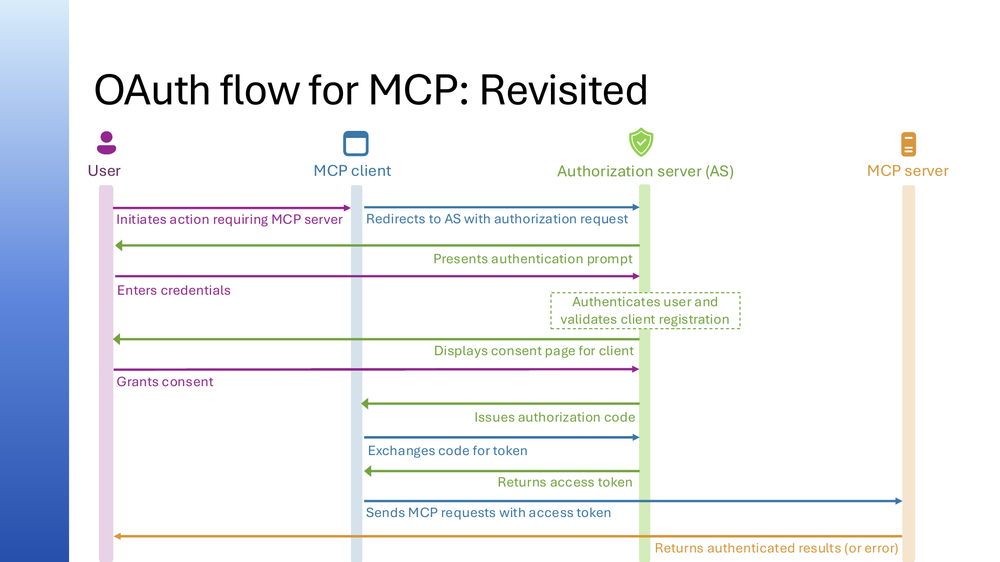

```
OAuth flow for MCP: Revisited
User                               MCP client                            Authorization server (AS)                          MCP server

   Initiates action requiring MCP server   Redirects to AS with authorization request

                                                     Presents authentication prompt

   Enters credentials
                                                                            Authenticates user and
                                                                          validates client registration

                                                     Displays consent page for client

   Grants consent

                                                            Issues authorization code

                                           Exchanges code for token

                                                                Returns access token

                                           Sends MCP requests with access token

                                                                                          Returns authenticated results (or error)
```

## Slide 24


```
How does authorization server validate client?
     Does authorization server know the MCP client?


Pre-registration         Do authorization server and MCP client support CIMD?


                               CIMD:                            DCR:
                      Client Identity Metadata             Dynamic Client
                             Document                        Registration
                          (most common)                   (legacy fallback)
```

## Slide 25


```
Client ID Metadata Document
CIMD document format:
{
    "client_id": "https://app.example.com/oauth/client-metadata.json",
    "client_name": "Example MCP Client",
    "client_uri": "https://app.example.com",
    "logo_uri": "https://app.example.com/logo.png",
    "redirect_uris": [
      "http://127.0.0.1:3000/callback",
      "http://localhost:3000/callback"
    ],
    "grant_types": ["authorization_code"],
    "response_types": ["code"],
    "token_endpoint_auth_method": "none"
}

VS Code example: https://vscode.dev/oauth/client-metadata.json
```

## Slide 26


```
CIMD flow                                                Assuming CIMD at https://app.example.com/oauth/metadata.json

                                                                                                                                      MCP client
User                               MCP client                                     Authorization server (AS)                        metadata endpoint

   Initiates action requiring MCP server   Redirects to AS with authorization request
                                           client_id=https://app.example.com/oauth/metadata.json

                                                         Presents authentication prompt

   Enters credentials                                                                   Authenticates user
                                                                                      Detects client_id is URL
                                                                                                   Fetches CIMD
                                                                                                   https://app.example.com/oauth/metadata.json
                                                                                                             Returns CIMD JSON document
                                                                                           Validates CIMD

                                                         Displays consent page for client
   Grants consent
                                                                 Issues authorization code

                                           Exchanges code for token
                                           client_id=https://app.example.com/oauth/metadata.json


                                                                      Returns access token
```

## Slide 27


```
DCR flow                                                                  Only the initial client registration step differs.


                            User                                              MCP client                                                                 Authorization server (AS)

                                                                                      Sends a Dynamic Client Registration request to /register
                                                                                      ?redirect_uris=..grant_types=..&client_name=....                     Stores in client database

                                                                                                                                                     Returns client_id


Standard OAuth 2.1 flow, with new client ID
                                              Initiates action requiring MCP server   Redirects to AS with authorization request ?client_id=NEW_CLIENT_ID

                                                                                                                                    Presents authentication prompt

                                               Enters credentials                                                                                            Authenticates user and
                                                                                                                                                           validates client registration

                                                                                                                                    Displays consent page for client

                                               Grants consent
                                                                                                                                          Issues authorization code

                                                                                      Exchanges code for token

                                                                                                                                                 Returns access token
```

## Slide 28


```
Support for the full MCP authorization spec
Authorization                                AS Metadata   Client ID   Dynamic Client
provider                                     Discovery     Metadata    Registration
                                                           Document

Microsoft
                Hosted identity server         (OIDC)
Entra
KeyCloak        OSS identity server                                       (some bugs)
                Identity server
Descope         (+ wrapper of Entra, etc)

WorkOS          Identity server
AuthKit         (+ wrapper of Entra, etc.)

Okta Auth0      Hosted identity server

ScaleKit        Hosted identity server
```

## Slide 29


```
Support for OAuth in Python FastMCP servers
                  OAuthProvider


  RemoteAuthProvider              OAuthProxy

    DescopeProvider                  Auth0Provider
    SupabaseProvider                 AzureProvider
                                  AWSCognitoProvider
    ScalekitProvider                OCIProvider
    AuthKitProvider               DiscordProvider
                                  GitHubProvider
                                  GoogleProvider
                                  WorkOSProvider
```

## Slide 30

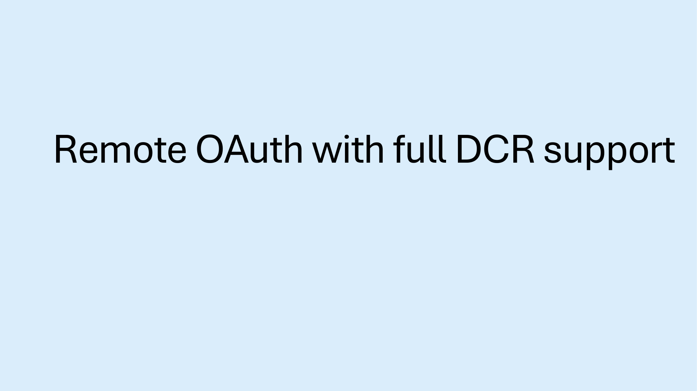

```
Remote OAuth with full DCR support
```

## Slide 31


```
Using Remote OAuth in Python FastMCP server
For a hosted provider like Scalekit that is fully compliant with MCP auth,
FastMCP provides an easy-to-use subclass of RemoteAuthProvider:
from fastmcp.server.auth.providers.scalekit import ScalekitProvider

auth_provider = ScalekitProvider(
  environment_url=SCALEKIT_ENVIRONMENT_URL,
  resource_id=SCALEKIT_RESOURCE_ID,
  base_url=MCP_SERVER_URL,
  required_scopes=["read"]
)

mcp = FastMCP(name="My MCP server", auth=auth_provider)


Come to office hours after after for a demo of ScaleKit!
```

## Slide 32


```
KeyCloak: Open-source identity server
                               Keycloak is an OAuth 2.1
                               compliant identity server
                               that can be deployed
                               via a Docker image.

                               Keycloak supports DCR
                               but has a few open issues.
```

## Slide 33


```
Integrating Keycloak with FastMCP server
We can use a custom subclass of RemoteAuthProvider that works around the
open issues with DCR implementation in Keycloak.

 from fastmcp.server.auth import RemoteAuthProvider

 class KeycloakAuthProvider(RemoteAuthProvider):

 def __init__(                                   auth = KeycloakAuthProvider(
    self, *,                                       realm_url=KEYCLOAK_REALM_URL,
    realm_url: AnyHttpUrl | str,                   base_url=keycloak_base_url,
    base_url: AnyHttpUrl | str,                    required_scopes=["openid", "mcp:access"],
    required_scopes: list[str] | None = None,      audience=keycloak_audience,
    audience: str | list[str] | None = None,     )
    token_verifier: JWTVerifier | None = None,
                                                           servers/auth_mcp.py
 ):
  ....

   aka.ms/python-mcp-demos: servers/keycloak_provider.py
```

## Slide 34


```
Deploying example server with KeyCloak
1. Open this GitHub repository:
  aka.ms/python-mcp-demos
2. Follow instructions in README for "Deploy to Azure with Keycloak":
   >> azd auth login
   >> azd env set MCP_AUTH_PROVIDER keycloak
   >> azd env set KEYCLOAK_ADMIN_PASSWORD "YourSecurePassword123"
   >> azd up
```

## Slide 35

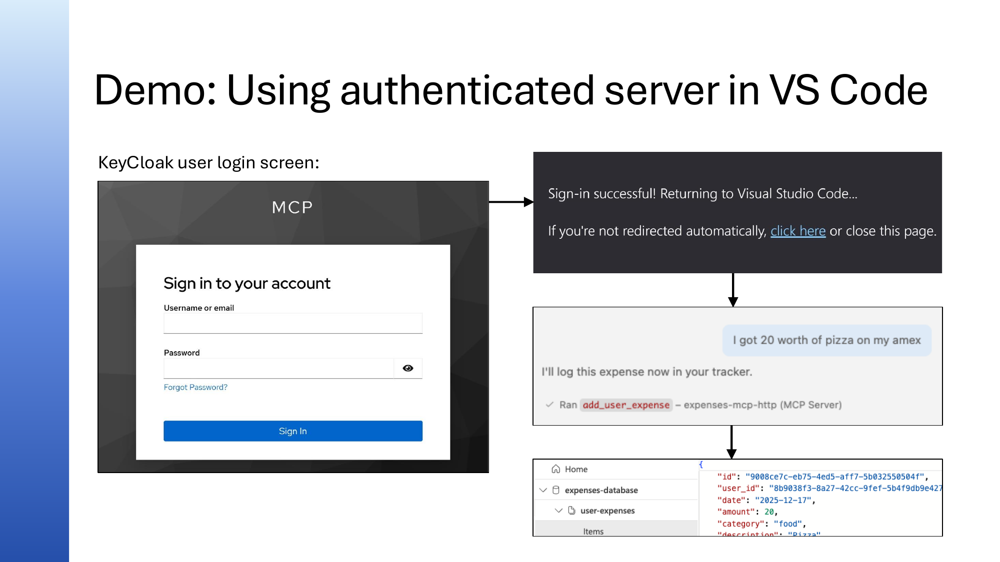

```
Demo: Using authenticated server in VS Code
KeyCloak user login screen:
```

## Slide 36

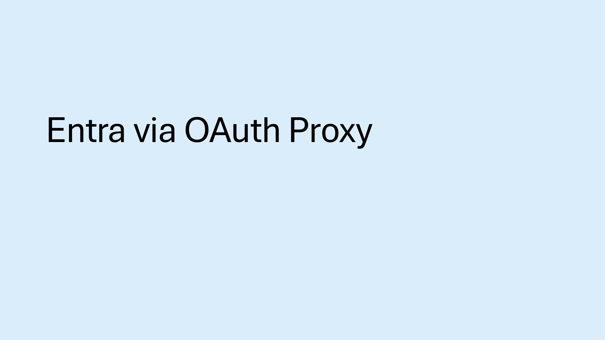

```
Entra via OAuth Proxy
```

## Slide 37


```
Entra support via OAuth Proxy
To compensate for Entra's lack of DCR support, we can implement with a proxy:


                      Authorization server (AS)

                                          Database
                                  +       for client ID storage
                        FastMCP OAuth Proxy


                                                  Access token
   MCP client                                                     FastMCP server


                                User
```

## Slide 38


```
Integrating Entra with FastMCP server
FastMCP provides AzureProvider, a subclass of OAuthProxy that implements DCR:
from fastmcp.server.auth.providers.azure import AzureProvider

oauth_container = cosmos_db.get_container_client(os.environ["AUTH_CONTAINER"])
oauth_client_store = CosmosDBStore(container=oauth_container,
                                   default_collection="oauth-clients")

auth = AzureProvider(
  client_id=os.environ["ENTRA_PROXY_AZURE_CLIENT_ID"],
  client_secret=os.environ["ENTRA_PROXY_AZURE_CLIENT_SECRET"],
  tenant_id=os.environ["AZURE_TENANT_ID"],
  base_url=os.environ["ENTRA_PROXY_MCP_SERVER_BASE_URL"],
  required_scopes=["mcp-access"],
  client_storage=oauth_client_store,
)

  aka.ms/python-mcp-demos: servers/auth_mcp.py
```

## Slide 39


```
Deploying example server with Entra Proxy
1. Open this GitHub repository:
  aka.ms/python-mcp-demos

2. Follow README steps for "Deploy to Azure with Entra OAuth Proxy":
   >> azd auth login
   >> azd env set MCP_AUTH_PROVIDER entra_proxy
   >> azd env set AZURE_TENANT_ID your-tenant-id
   >> azd up
```

## Slide 40

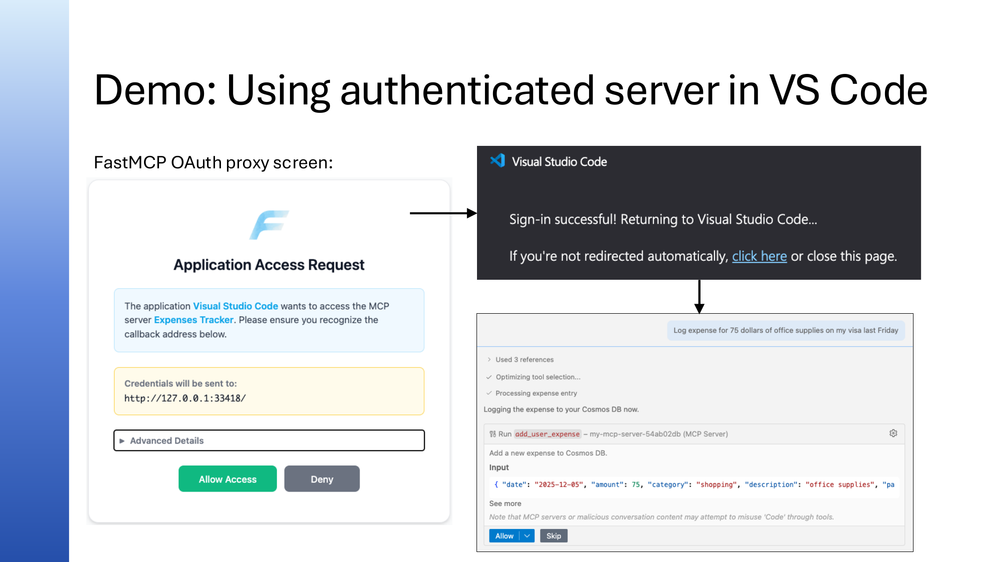

```
Demo: Using authenticated server in VS Code
FastMCP OAuth proxy screen:
```

## Slide 41


```
Alternative: Only support pre-registered clients
If your MCP server does not need to be usable by arbitrary MCP clients, then you
don't need to worry about DCR support.

Known client IDs:

• VS Code (aebc6443-996d-45c2-90f0-388ff96faa5)
• Other Microsoft products
• Your own custom client applications
```

## Slide 42


```
Deploying Azure Function with Pre-registration
1. Open this GitHub repository:
  github.com/Azure-Samples/mcp-sdk-functions-hosting-python
2. Follow instructions in README for deploying:
 >> azd env set PRE_AUTHORIZED_CLIENT_IDS aebc6443-996d-45c2-90f0-388ff96faa56
 >> azd up


                         Entra Authorization Server

                      Built-in Auth Middleware (PRM)


   VS Code                                       Access token
 (MCP client)                                                    Azure Functions
                                                                  (MCP server)
```

## Slide 43


```
Next steps
Watch past recordings:                Dec 16:
aka.ms/pythonmcp/resources        Building MCP servers with FastMCP

Come to office hours after each      Dec 17:
session in Discord:
                                  Deploying MCP servers to the cloud
aka.ms/pythonai/oh

                                     Dec 18:
Learn from MCP for Beginners:
aka.ms/mcp-for-beginners
                                  Authentication for MCP servers
```

## Slide 44

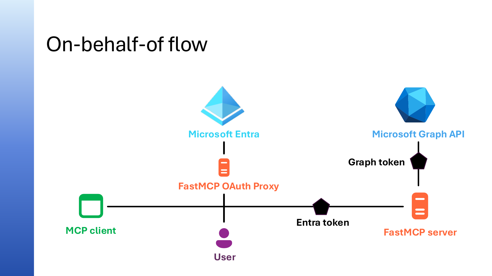

```
On-behalf-of flow


                Microsoft Entra                    Microsoft Graph API

                                               Graph token

               FastMCP OAuth Proxy


                                     Entra token
  MCP client                                         FastMCP server

                     User
```
