# Python + MCP: Authentication for MCP servers

This is the third and final session in the Python + MCP series. The previous sessions covered building MCP servers with FastMCP and deploying them to Azure. This session focuses on adding authentication layers to MCP servers, covering key-based access, the OAuth 2.1 flow for MCP, and integrations with Keycloak and Microsoft Entra.

## Table of contents

- [Restricting access to MCP servers](#restricting-access-to-mcp-servers)
- [MCP architecture recap](#mcp-architecture-recap)
- [Three approaches to restricting access](#three-approaches-to-restricting-access)
- [Key-based access flow](#key-based-access-flow)
- [Using a key-based MCP server in VS Code](#using-a-key-based-mcp-server-in-vs-code)
- [Using a key-based MCP server from an AI agent](#using-a-key-based-mcp-server-from-an-ai-agent)
- [Deploying key-based access in Azure](#deploying-key-based-access-in-azure)
- [Deploying an Azure Function with key access](#deploying-an-azure-function-with-key-access)
- [Using a deployed function from VS Code](#using-a-deployed-function-from-vs-code)
- [OAuth-based access flow](#oauth-based-access-flow)
- [OAuth 2.1 overview](#oauth-21-overview)
- [Simplified OAuth flow for MCP](#simplified-oauth-flow-for-mcp)
- [Authorization server discovery](#authorization-server-discovery)
- [PRM flow: discovering the authorization server](#prm-flow-discovering-the-authorization-server)
- [PRM support in Python FastMCP servers](#prm-support-in-python-fastmcp-servers)
- [Authorization server metadata discovery](#authorization-server-metadata-discovery)
- [How the authorization server validates the client](#how-the-authorization-server-validates-the-client)
- [Client ID Metadata Document (CIMD)](#client-id-metadata-document-cimd)
- [CIMD flow](#cimd-flow)
- [Dynamic Client Registration (DCR)](#dynamic-client-registration-dcr)
- [Authorization provider support comparison](#authorization-provider-support-comparison)
- [OAuth provider classes in FastMCP](#oauth-provider-classes-in-fastmcp)
- [Remote OAuth with full DCR support](#remote-oauth-with-full-dcr-support)
- [Keycloak: open-source identity server](#keycloak-open-source-identity-server)
- [Integrating Keycloak with FastMCP](#integrating-keycloak-with-fastmcp)
- [Deploying the example server with Keycloak](#deploying-the-example-server-with-keycloak)
- [Entra via OAuth Proxy](#entra-via-oauth-proxy)
- [Integrating Entra with FastMCP](#integrating-entra-with-fastmcp)
- [Deploying the example server with Entra](#deploying-the-example-server-with-entra)
- [Alternative: only support pre-registered clients](#alternative-only-support-pre-registered-clients)
- [Deploying Azure Function with pre-registration](#deploying-azure-function-with-pre-registration)
- [Next steps](#next-steps)

## Restricting access to MCP servers

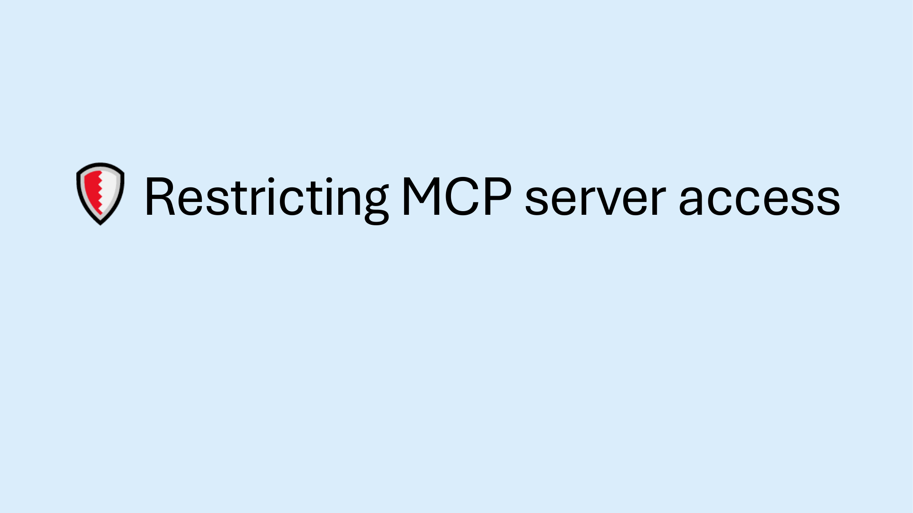
[Watch from 02:36](https://www.youtube.com/watch?v=_Redi3ChzFA&t=156s)

MCP servers expose tools, prompts, and resources over the network. When those servers are publicly hosted, you need mechanisms to control who can access them.

## MCP architecture recap

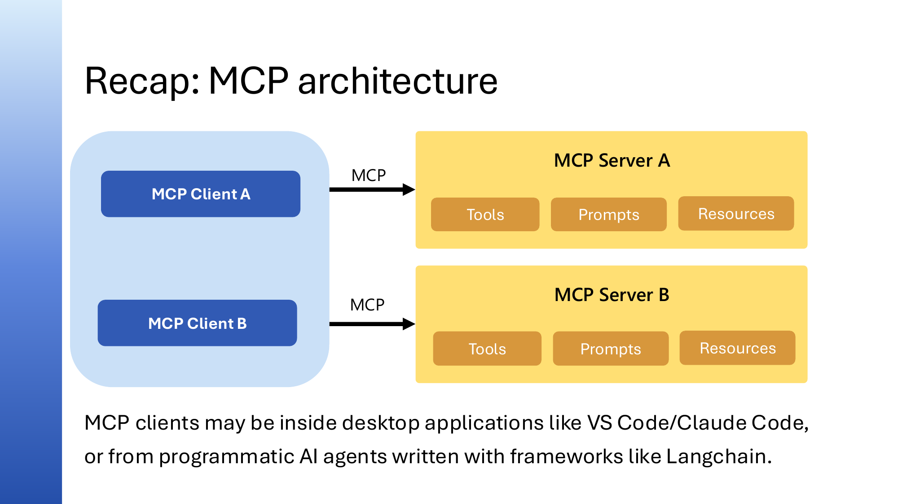
[Watch from 03:08](https://www.youtube.com/watch?v=_Redi3ChzFA&t=188s)

MCP clients communicate with MCP servers using the MCP protocol. Clients may be desktop applications like VS Code or Claude Code, or programmatic AI agents written with frameworks like LangChain or Agent Framework. Servers expose tools, prompts, and resources that clients can use.

## Three approaches to restricting access

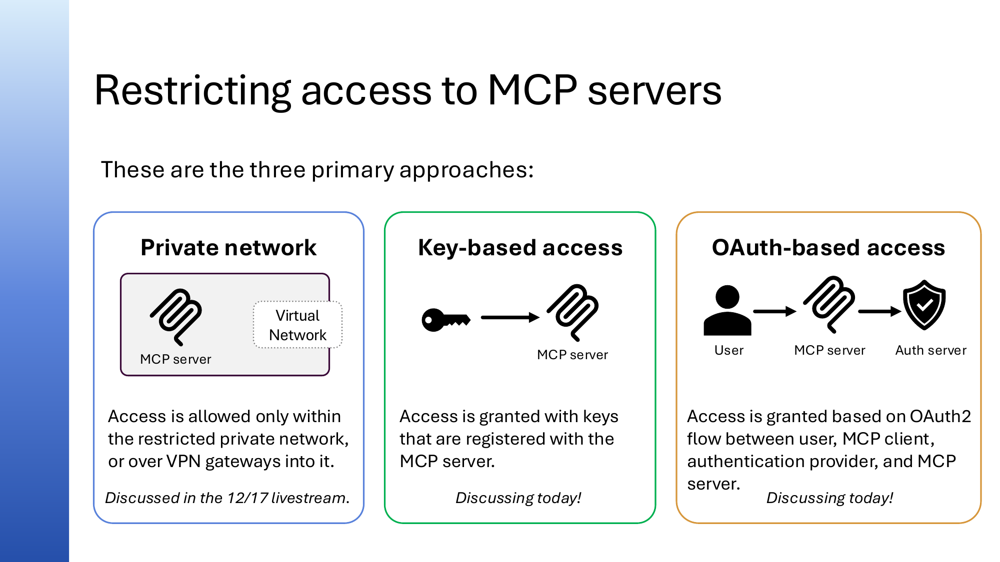
[Watch from 04:02](https://www.youtube.com/watch?v=_Redi3ChzFA&t=242s)

There are three primary ways to restrict access to MCP servers:

**Private network** — Deploy the MCP server inside a virtual network and disable public ingress. Only clients within the network or connected via VPN can reach it. This was covered in the previous session on deploying MCP servers.

**Key-based access** — Issue keys that clients must include with their requests. The server verifies the key before responding. Simple to implement but carries risk of key exposure.

**OAuth-based access** — Use OAuth 2.1 to authenticate users. The MCP client obtains an access token through an authorization server, then sends it to the MCP server. The server can identify who the user is and restrict what data they can access.

## Key-based access flow

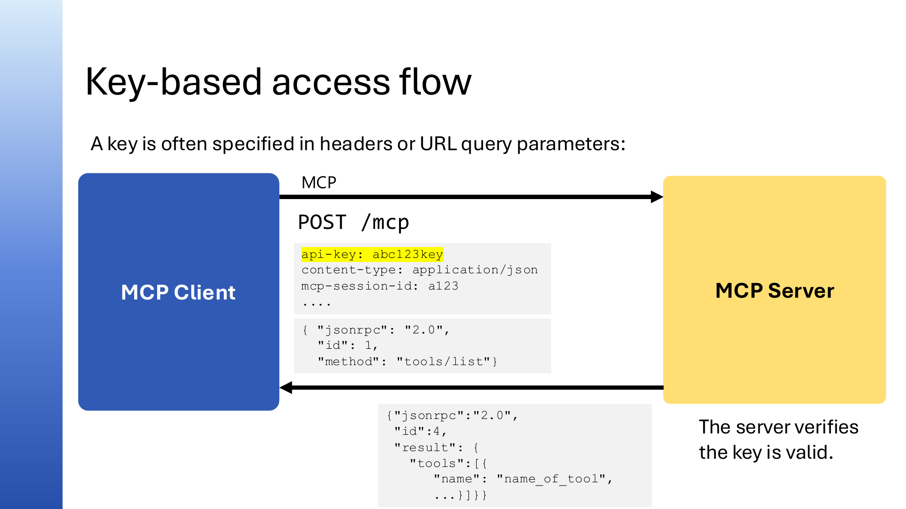
[Watch from 06:21](https://www.youtube.com/watch?v=_Redi3ChzFA&t=381s)

With key-based access, the MCP client sends a key in the HTTP headers (or sometimes query parameters) when making requests to the MCP server. The server receives the key, verifies it against its known valid keys, and responds if the key is valid. The key is typically placed in a header like `api-key` or as a `Bearer` token in the `Authorization` header.

## Using a key-based MCP server in VS Code

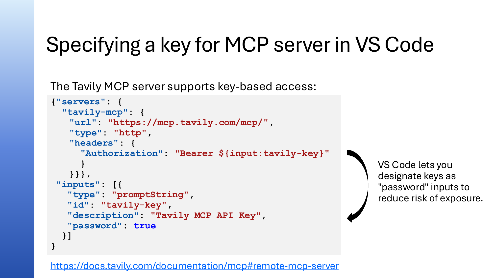
[Watch from 07:30](https://www.youtube.com/watch?v=_Redi3ChzFA&t=450s)

The [Tavily MCP server](https://docs.tavily.com/documentation/mcp#remote-mcp-server) is available at `https://mcp.tavily.com/mcp/` and requires a key in the `Authorization: Bearer` header. In VS Code, you can configure this in your `mcp.json` file and use `${input:tavily-key}` with `"password": true` to have VS Code securely prompt for and store the key. This prevents accidental exposure of the key.

Once configured, VS Code stores the key in its secret store. When GitHub Copilot needs to use the Tavily server (for example, to search the web for up-to-date information), it sends the key automatically with each request.

## Using a key-based MCP server from an AI agent

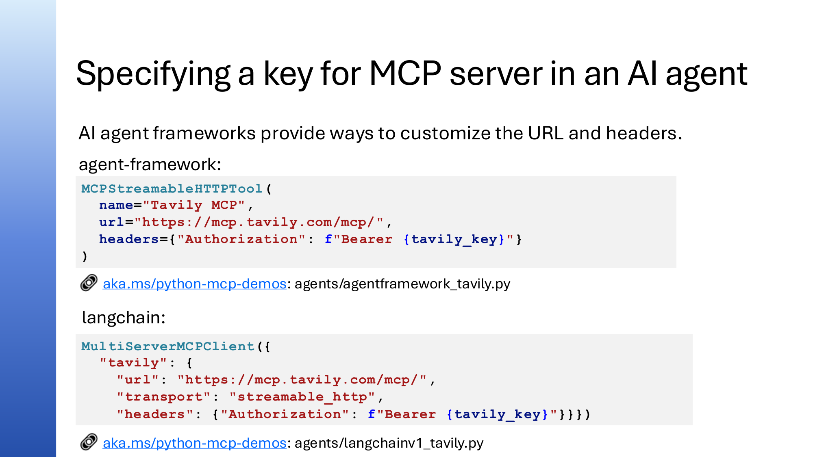
[Watch from 11:27](https://www.youtube.com/watch?v=_Redi3ChzFA&t=687s)

AI agent frameworks provide ways to customize the URL and headers when connecting to MCP servers. With Agent Framework, use `MCPStreamableHTTPTool` and pass the key via the `headers` parameter. With LangChain, use `MultiServerMCPClient` and set the `headers` in the server configuration. In both cases, load the key from an environment variable rather than hardcoding it.

The key is per-user. If a key is accidentally exposed (checked into version control, shown on screen during a presentation, embedded in client-side code), revoke it immediately and create a new one.

Code: [aka.ms/python-mcp-demos](https://aka.ms/python-mcp-demos)

## Deploying key-based access in Azure

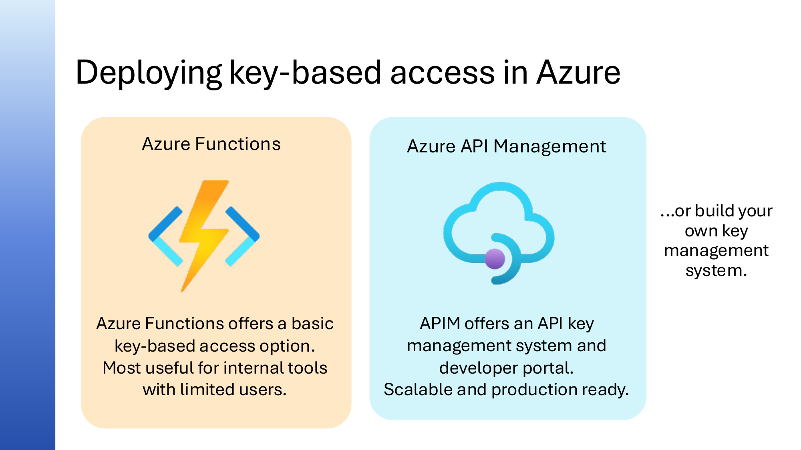
[Watch from 14:48](https://www.youtube.com/watch?v=_Redi3ChzFA&t=888s)

Two Azure services work well for key-based MCP servers:

**Azure Functions** offers a basic built-in key management system. It supports a small number of keys and is most useful for internal tools with limited users. It does not include key rotation or a developer portal.

**Azure API Management (APIM)** offers a full API key management system with a developer portal where users can sign up, get API keys, revoke keys, and manage their access. This is the right choice for public-facing MCP servers that need to serve many developers, similar to how Tavily manages its API access.

## Deploying an Azure Function with key access

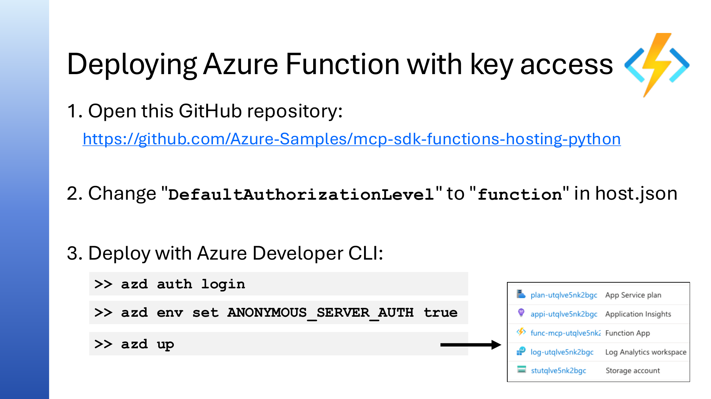
[Watch from 16:38](https://www.youtube.com/watch?v=_Redi3ChzFA&t=998s)

To deploy an MCP server as an Azure Function with key-based access:

1. Open the [mcp-sdk-functions-hosting-python](https://github.com/Azure-Samples/mcp-sdk-functions-hosting-python) repository.
2. Change `DefaultAuthorizationLevel` to `function` in `host.json`.
3. Deploy with Azure Developer CLI:
   ```
   azd auth login
   azd env set ANONYMOUS_SERVER_AUTH true
   azd up
   ```

The deployment creates a Function App, App Service plan, Application Insights, Log Analytics workspace, and Storage account. Once deployed, the function's keys can be managed in the Azure portal.

## Using a deployed function from VS Code

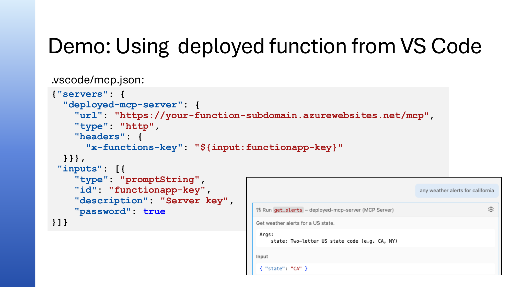
[Watch from 18:17](https://www.youtube.com/watch?v=_Redi3ChzFA&t=1097s)

To use the deployed Azure Function from VS Code, add it to `.vscode/mcp.json` with the function URL and the `x-functions-key` header. Use `${input:functionapp-key}` with `"password": true` to securely store the key. Azure Functions expects the key in the `x-functions-key` header, which is different from the `Authorization: Bearer` header used by services like Tavily. Each server defines its own expected header format.

## OAuth-based access flow

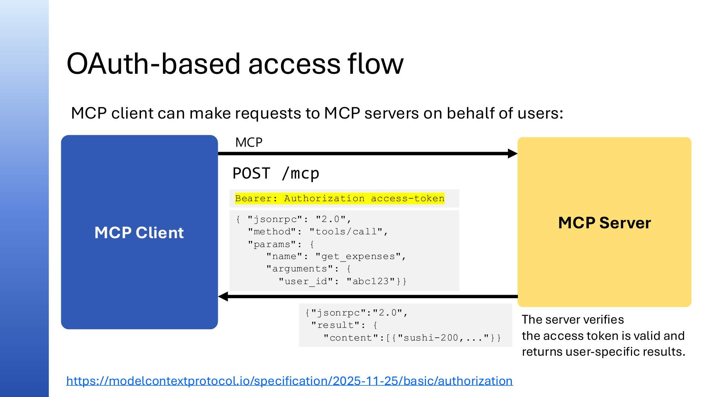
[Watch from 20:25](https://www.youtube.com/watch?v=_Redi3ChzFA&t=1225s)

With OAuth-based access, the MCP client sends a bearer authorization access token with each request. The MCP server verifies the token is valid and returns user-specific results. Unlike key-based access where a key identifies the client application, OAuth identifies the actual user. The server can look at claims in the token to determine who the user is and what data to return.

MCP auth specification: [modelcontextprotocol.io/specification/2025-11-25/basic/authorization](https://modelcontextprotocol.io/specification/2025-11-25/basic/authorization)

## OAuth 2.1 overview

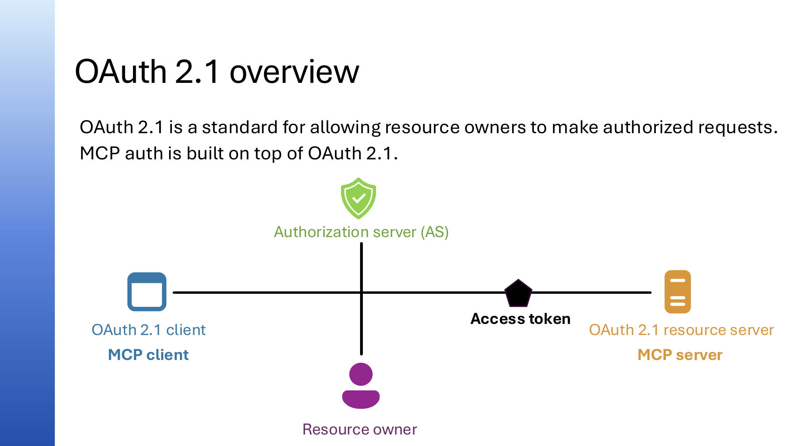
[Watch from 21:45](https://www.youtube.com/watch?v=_Redi3ChzFA&t=1305s)

MCP auth is built on top of OAuth 2.1, which involves four entities:

- **Authorization server (AS)** — For example, Microsoft Entra. It manages users and determines who is allowed access.
- **OAuth 2.1 client / MCP client** — The application requesting access on behalf of the user (VS Code, Claude Desktop, a programmatic agent).
- **OAuth 2.1 resource server / MCP server** — The server that has the resources the user wants to access.
- **Resource owner** — The user who owns the data and authorizes the client to access it.

## Simplified OAuth flow for MCP

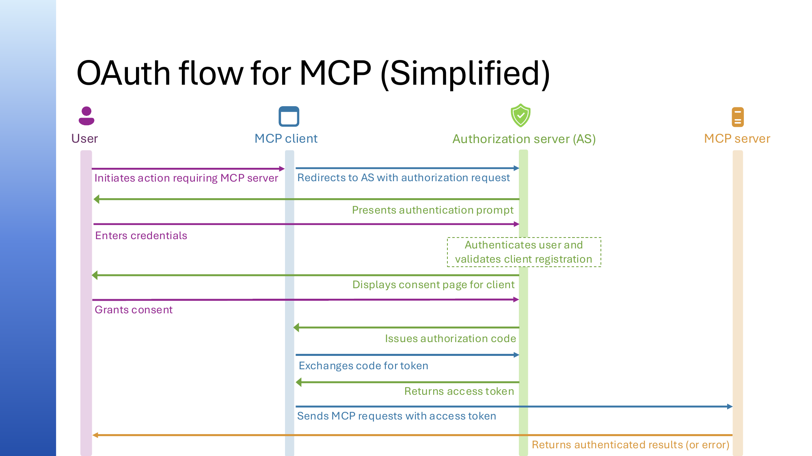
[Watch from 23:55](https://www.youtube.com/watch?v=_Redi3ChzFA&t=1435s)

The simplified flow works as follows: The user initiates an action requiring the MCP server. The MCP client redirects to the authorization server with an authorization request. The authorization server presents a login prompt. The user enters credentials. The authorization server authenticates the user, validates the client registration, and displays a consent page. The user grants consent. The authorization server issues an authorization code. The MCP client exchanges that code for an access token. The MCP client then sends requests to the MCP server with the access token, and the server returns authenticated results.

Getting to the point where the client can send an access token requires several preliminary steps that happen before this flow.

## Authorization server discovery

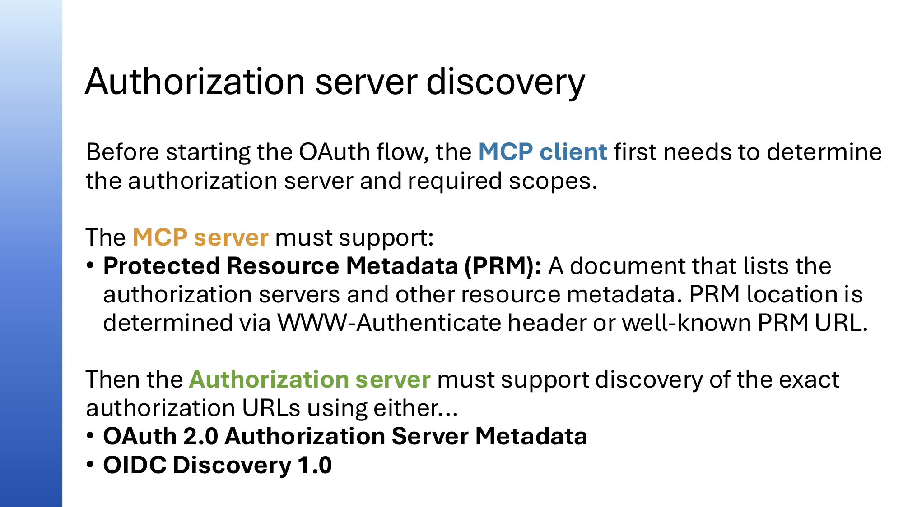
[Watch from 27:04](https://www.youtube.com/watch?v=_Redi3ChzFA&t=1624s)

Before starting the OAuth flow, the MCP client needs to discover which authorization server to use and what scopes are required.

The MCP server must support **Protected Resource Metadata (PRM)**: a JSON document listing the authorization servers and other resource metadata. The PRM location is determined via the `WWW-Authenticate` header or a well-known PRM URL.

Then the authorization server must support discovery of its exact authorization URLs via either **OAuth 2.0 Authorization Server Metadata** or **OIDC Discovery 1.0**.

## PRM flow: discovering the authorization server

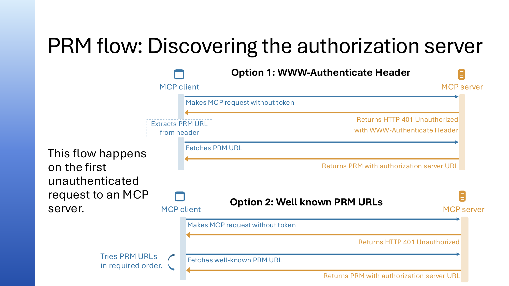
[Watch from 28:24](https://www.youtube.com/watch?v=_Redi3ChzFA&t=1704s)

PRM discovery happens on the first unauthenticated request to an MCP server. Two options:

**Option 1: WWW-Authenticate header** — The MCP client makes a request without a token. The server returns HTTP 401 with a `WWW-Authenticate` header that contains the PRM URL. The client fetches that URL and gets back a JSON document with the authorization server URL.

**Option 2: Well-known PRM URLs** — The MCP client makes a request without a token. The server returns HTTP 401 without the `WWW-Authenticate` header. The client tries well-known URLs (like `/.well-known/oauth-protected-resource`) in a specified order until it finds a valid PRM document.

## PRM support in Python FastMCP servers

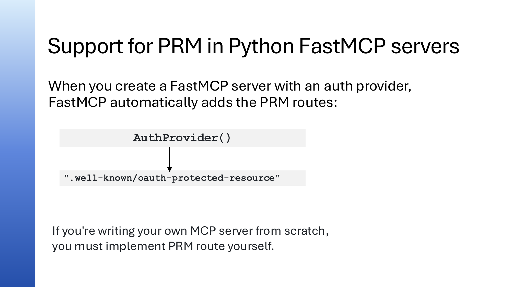
[Watch from 29:50](https://www.youtube.com/watch?v=_Redi3ChzFA&t=1790s)

When you create a FastMCP server with an auth provider, FastMCP automatically adds the PRM route at `/.well-known/oauth-protected-resource` and includes the `WWW-Authenticate` header in 401 responses. If you are writing your own MCP server from scratch without FastMCP, you must implement the PRM route yourself.

## Authorization server metadata discovery

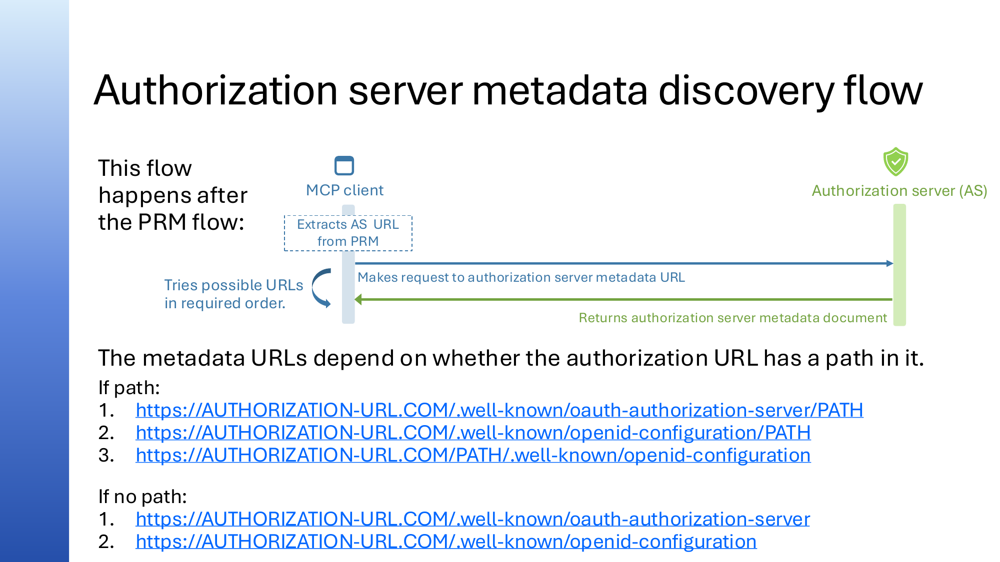
[Watch from 30:28](https://www.youtube.com/watch?v=_Redi3ChzFA&t=1828s)

After obtaining the authorization server URL from the PRM, the MCP client needs to discover the exact authorization endpoints. It makes requests to well-known URLs on the authorization server, trying in order:

For URLs with a path: `/.well-known/oauth-authorization-server/PATH`, then `/.well-known/openid-configuration/PATH`, then `/PATH/.well-known/openid-configuration`.

For URLs without a path: `/.well-known/oauth-authorization-server`, then `/.well-known/openid-configuration`.

For example, Microsoft Entra supports the `/.well-known/openid-configuration` URL. The returned metadata document contains all the detailed information needed to authenticate (token endpoint, authorization endpoint, supported grant types, etc.).

## How the authorization server validates the client

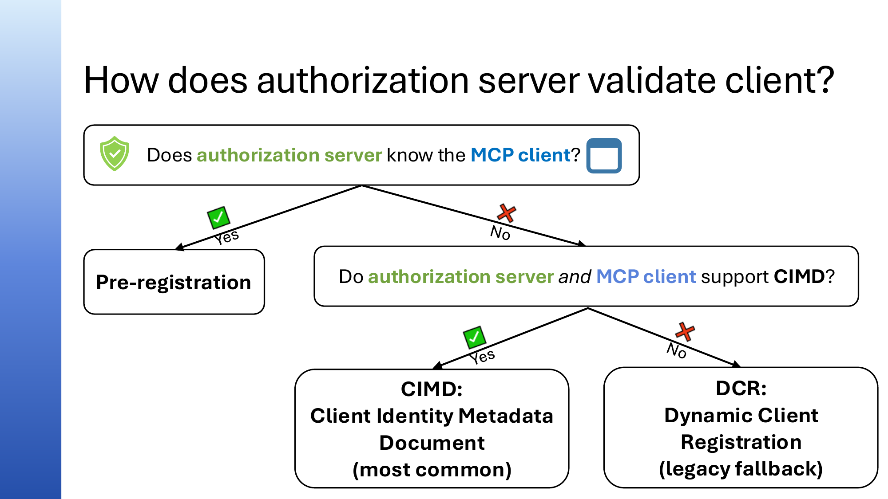
[Watch from 32:19](https://www.youtube.com/watch?v=_Redi3ChzFA&t=1939s)

During the OAuth flow, the authorization server needs to validate the MCP client. Usually authorization servers know their clients through pre-registration, but MCP clients are numerous and arbitrary (VS Code, Claude Desktop, ChatGPT, custom agents). Three paths exist:

**Pre-registration** — The authorization server already knows the client. This works if you control both client and server, or only need to support specific clients like VS Code.

**CIMD (Client Identity Metadata Document)** — The preferred modern approach. The MCP client hosts a metadata document at an HTTPS URL that describes itself. The authorization server fetches and validates this document.

**DCR (Dynamic Client Registration)** — The legacy fallback. The MCP client registers itself with the authorization server, which stores the registration in a database and issues a client ID.

## Client ID Metadata Document (CIMD)

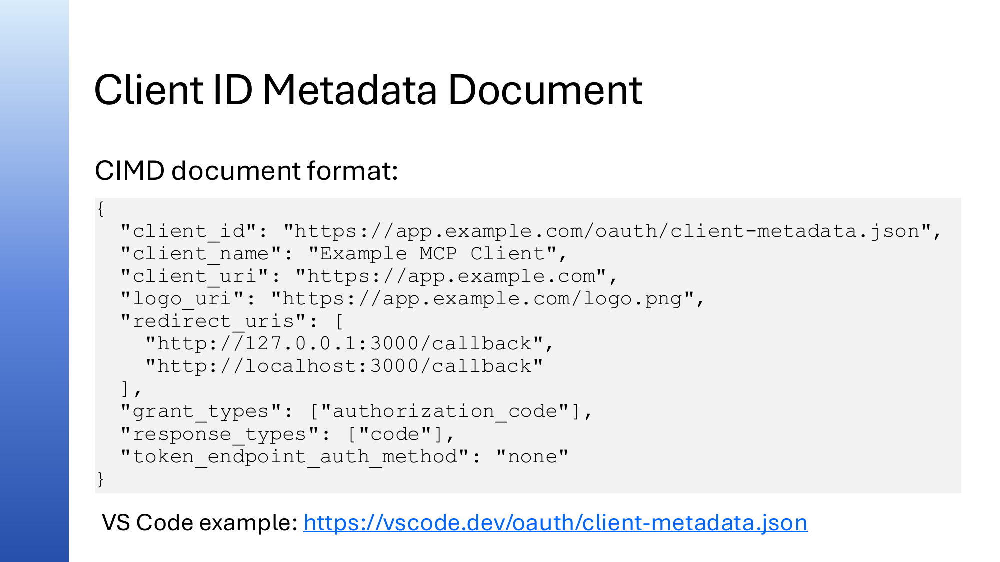
[Watch from 35:18](https://www.youtube.com/watch?v=_Redi3ChzFA&t=2118s)

A CIMD is a JSON document hosted at an HTTPS URL that describes the OAuth client. It includes the client name, redirect URIs, grant types, response types, and token endpoint auth method. VS Code already hosts its CIMD at [vscode.dev/oauth/client-metadata.json](https://vscode.dev/oauth/client-metadata.json). Cursor has also added CIMD support.

CIMD is very new (as of late 2025) and is the preferred path going forward. It avoids the downsides of DCR since the authorization server does not need to maintain a database of client registrations.

## CIMD flow

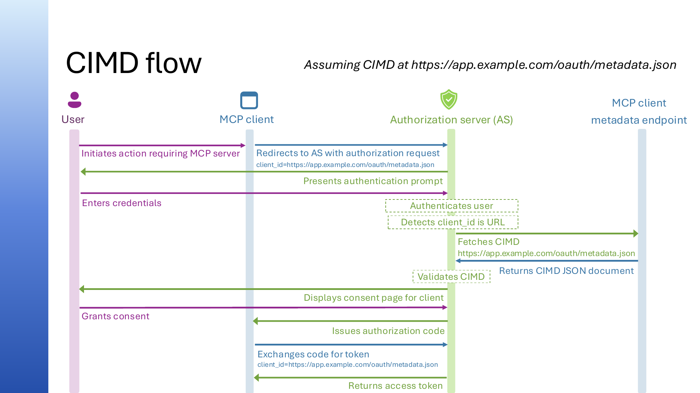
[Watch from 36:53](https://www.youtube.com/watch?v=_Redi3ChzFA&t=2213s)

When a client has a CIMD, it sets its `client_id` to the HTTPS URL of the CIMD document in the authorization request. The authorization server detects that the client ID is a URL, fetches the CIMD document, validates it for security, and uses it to identify the client. The consent page shows the client information from the CIMD. In all subsequent interactions, the client passes its CIMD URL as the client ID instead of a numeric ID.

## Dynamic Client Registration (DCR)

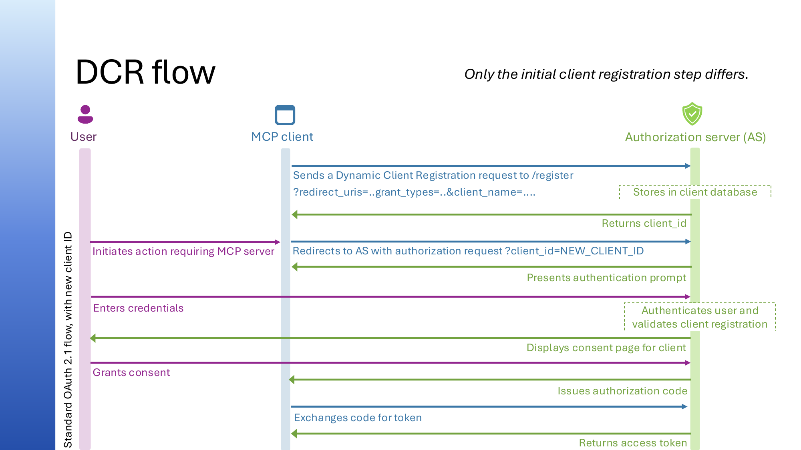
[Watch from 38:33](https://www.youtube.com/watch?v=_Redi3ChzFA&t=2313s)

With DCR, the MCP client sends a registration request to the authorization server's `/register` endpoint, providing its redirect URIs, grant types, client name, and other metadata. The authorization server stores this in a client database and returns a new client ID. The MCP client then uses that numeric ID for the standard OAuth 2.1 flow.

DCR has downsides for authorization servers: they must maintain a database of client registrations, manage its size, and protect the registration endpoint from DDoS attacks. These downsides motivated the MCP community to develop CIMD as a more server-friendly alternative.

## Authorization provider support comparison

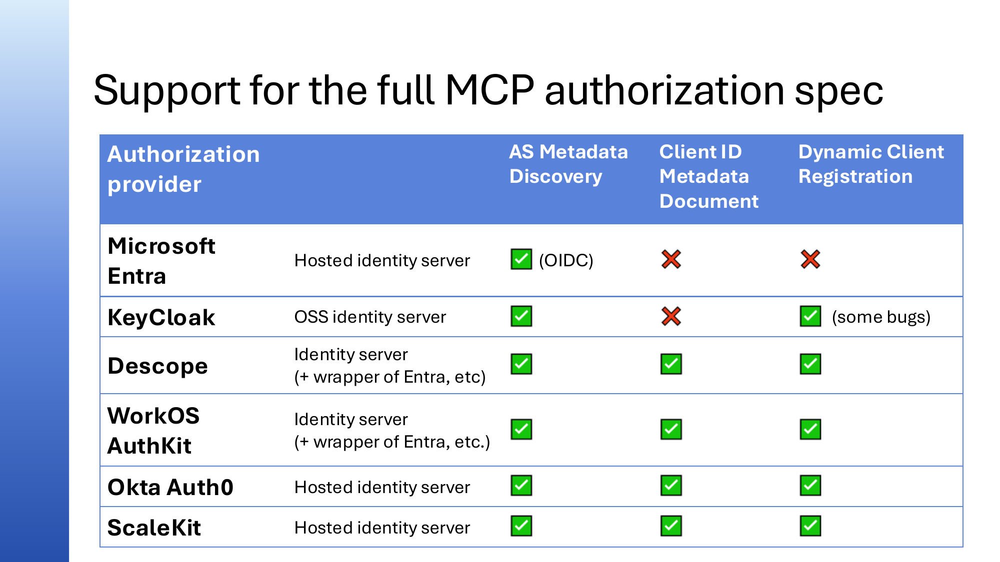
[Watch from 40:47](https://www.youtube.com/watch?v=_Redi3ChzFA&t=2447s)

Support for MCP auth features varies significantly across authorization providers:

| Provider | AS Metadata Discovery | CIMD | DCR |
|---|---|---|---|
| Microsoft Entra | Yes (OIDC) | No | No |
| Keycloak | Yes | No | Yes (some bugs) |
| Descope | Yes | Yes | Yes |
| WorkOS AuthKit | Yes | Yes | Yes |
| Okta Auth0 | Yes | Yes | Yes |
| ScaleKit | Yes | Yes | Yes |

Microsoft Entra only supports metadata discovery. It does not support CIMD or DCR. Newer identity servers like Descope, ScaleKit, and AuthKit are quicker to implement full support. Entra may add CIMD support in the future.

## OAuth provider classes in FastMCP

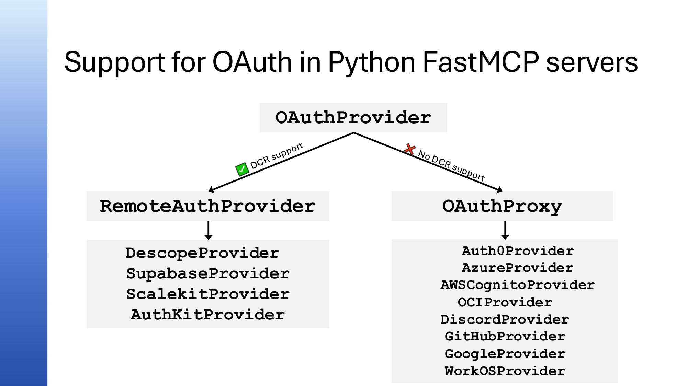
[Watch from 43:19](https://www.youtube.com/watch?v=_Redi3ChzFA&t=2599s)

FastMCP provides an `OAuthProvider` base class with two main branches:

**`RemoteAuthProvider`** — For identity providers with full DCR support. Subclasses include `DescopeProvider`, `SupabaseProvider`, `ScalekitProvider`, and `AuthKitProvider`.

**`OAuthProxy`** — For identity providers without DCR support. The proxy implements DCR on your server and forwards auth requests to the identity provider. Subclasses include `Auth0Provider`, `AzureProvider`, `AWSCognitoProvider`, `OCIProvider`, `DiscordProvider`, `GitHubProvider`, `GoogleProvider`, and `WorkOSProvider`.

## Remote OAuth with full DCR support

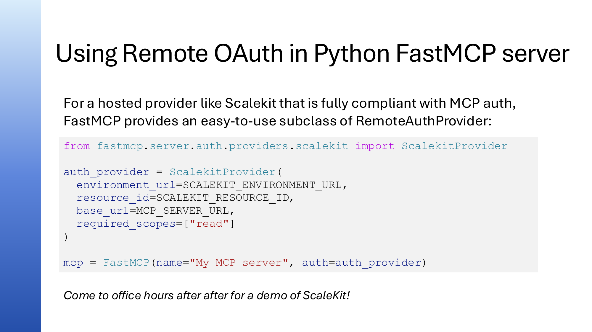
[Watch from 44:49](https://www.youtube.com/watch?v=_Redi3ChzFA&t=2689s)

For a fully compliant hosted provider like ScaleKit, FastMCP makes setup very simple:

```python
from fastmcp.server.auth.providers.scalekit import ScalekitProvider

auth_provider = ScalekitProvider(
    environment_url=SCALEKIT_ENVIRONMENT_URL,
    resource_id=SCALEKIT_RESOURCE_ID,
    base_url=MCP_SERVER_URL,
    required_scopes=["read"]
)

mcp = FastMCP(name="My MCP server", auth=auth_provider)
```

Five lines of provider setup and your MCP server has full OAuth authentication.

## Keycloak: open-source identity server

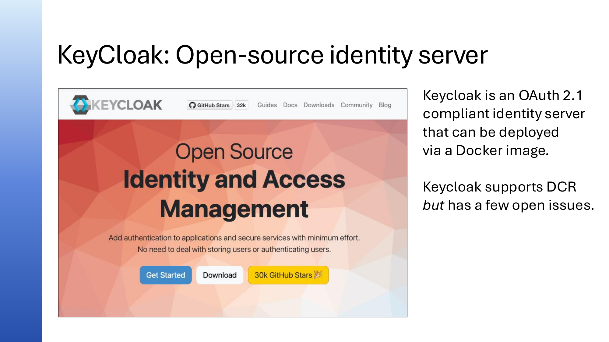
[Watch from 45:40](https://www.youtube.com/watch?v=_Redi3ChzFA&t=2740s)

Keycloak is an open-source OAuth 2.1 compliant identity server that can be deployed via a Docker image. It is useful if you want to bring your own set of users and groups to an MCP server without relying on a hosted identity service. Keycloak supports DCR but has a few open issues with its implementation.

## Integrating Keycloak with FastMCP

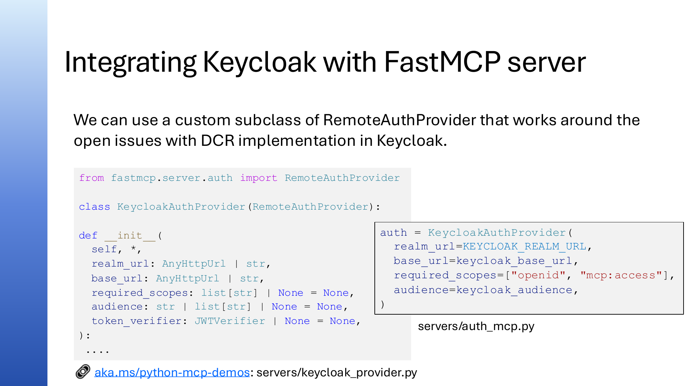
[Watch from 46:27](https://www.youtube.com/watch?v=_Redi3ChzFA&t=2787s)

Because Keycloak has some bugs in its DCR implementation, you need a custom subclass of `RemoteAuthProvider` that overrides the register route to fix incorrect headers. The subclass is at [aka.ms/python-mcp-demos](https://aka.ms/python-mcp-demos) in `servers/keycloak_provider.py`. Once defined, usage is straightforward:

```python
auth = KeycloakAuthProvider(
    realm_url=KEYCLOAK_REALM_URL,
    base_url=keycloak_base_url,
    required_scopes=["openid", "mcp:access"],
    audience=keycloak_audience,
)
```

## Deploying the example server with Keycloak

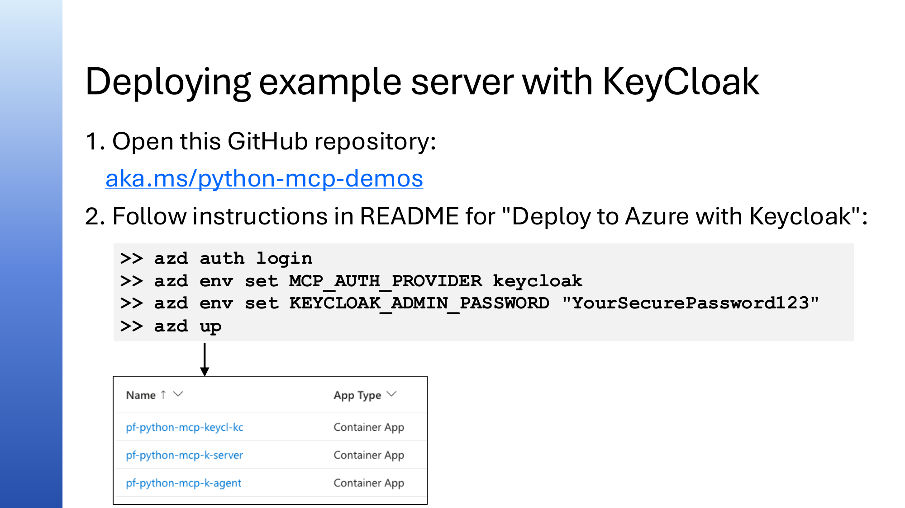
[Watch from 47:01](https://www.youtube.com/watch?v=_Redi3ChzFA&t=2821s)

To deploy the example MCP server with Keycloak authentication:

1. Open the [aka.ms/python-mcp-demos](https://aka.ms/python-mcp-demos) repository.
2. Follow the README instructions for "Deploy to Azure with Keycloak":
   ```
   azd auth login
   azd env set MCP_AUTH_PROVIDER keycloak
   azd env set KEYCLOAK_ADMIN_PASSWORD "YourSecurePassword123"
   azd up
   ```

This deploys both a Keycloak container app (running the Keycloak Docker image) and the MCP server configured to use it. The Keycloak admin console lets you manage realms, users, groups, and clients. In the demo, the full OAuth flow is visible in the server logs: the initial 401, the PRM URL fetch, the authorization server discovery, the DCR POST to `/register`, and finally the authenticated 200 responses.

The MCP server extracts the user ID from the OAuth token and stores it alongside data in Cosmos DB, confirming that user-specific data is correctly associated with the authenticated identity from Keycloak.

## Entra via OAuth Proxy

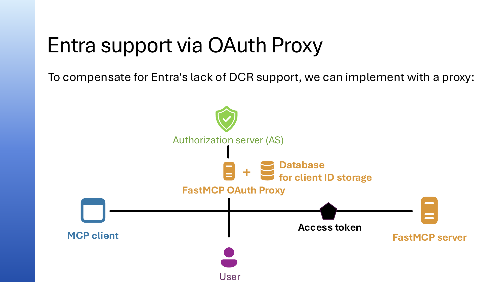
[Watch from 54:02](https://www.youtube.com/watch?v=_Redi3ChzFA&t=3242s)

Microsoft Entra does not support DCR or CIMD, so the FastMCP OAuth Proxy approach is needed. The proxy sits between the MCP client and the authorization server, implementing DCR on the MCP server itself. It requires a database for client ID storage — in this case, Cosmos DB.

The architecture has the MCP client talking to the FastMCP OAuth Proxy, which communicates with Entra as the authorization server. The proxy handles client registration requests and stores the registered clients in the database.

## Integrating Entra with FastMCP

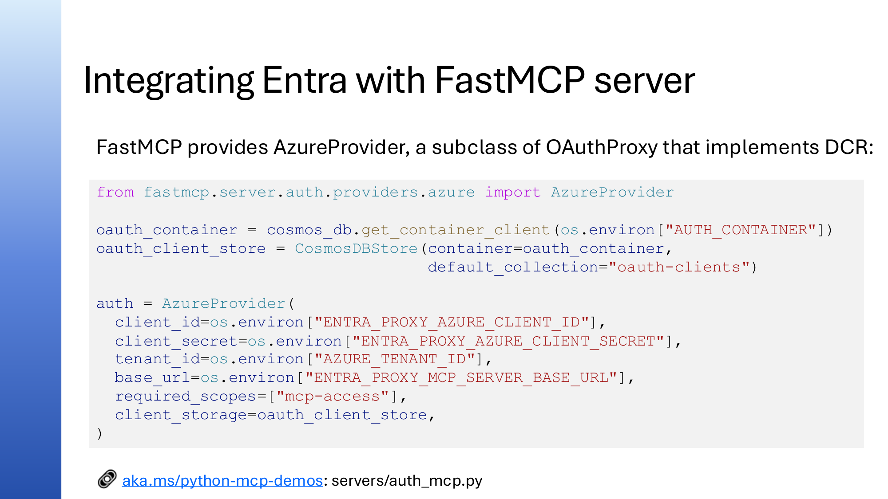
[Watch from 55:00](https://www.youtube.com/watch?v=_Redi3ChzFA&t=3300s)

FastMCP provides `AzureProvider`, a subclass of `OAuthProxy`, that implements DCR for Entra:

```python
from fastmcp.server.auth.providers.azure import AzureProvider

oauth_container = cosmos_db.get_container_client(os.environ["AUTH_CONTAINER"])
oauth_client_store = CosmosDBStore(container=oauth_container,
                                   default_collection="oauth-clients")

auth = AzureProvider(
    client_id=os.environ["ENTRA_PROXY_AZURE_CLIENT_ID"],
    client_secret=os.environ["ENTRA_PROXY_AZURE_CLIENT_SECRET"],
    tenant_id=os.environ["AZURE_TENANT_ID"],
    base_url=os.environ["ENTRA_PROXY_MCP_SERVER_BASE_URL"],
    required_scopes=["mcp-access"],
    client_storage=oauth_client_store,
)
```

For local development, an in-memory client store can be used instead of Cosmos DB. The Entra app registrations are automated in the deployment scripts using the Microsoft Graph SDK, which configures the tenant restriction, redirect URIs, and MCP server scopes.

Code: [aka.ms/python-mcp-demos](https://aka.ms/python-mcp-demos) in `servers/auth_mcp.py`

## Deploying the example server with Entra

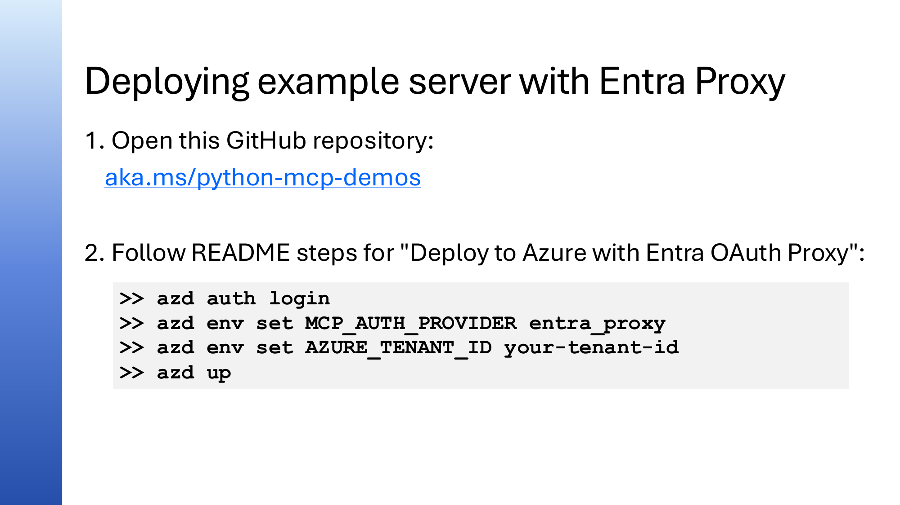
[Watch from 55:52](https://www.youtube.com/watch?v=_Redi3ChzFA&t=3352s)

To deploy the example server with Entra OAuth Proxy:

1. Open the [aka.ms/python-mcp-demos](https://aka.ms/python-mcp-demos) repository.
2. Follow the README for "Deploy to Azure with Entra OAuth Proxy":
   ```
   azd auth login
   azd env set MCP_AUTH_PROVIDER entra_proxy
   azd env set AZURE_TENANT_ID your-tenant-id
   azd up
   ```

In the demo, the OAuth flow goes through a FastMCP-provided consent screen (not the Entra login screen directly), because the OAuth Proxy handles the DCR step. Behind the scenes, the Entra login happens in the browser tab. Once authenticated, the server extracts the Entra Object ID (OID) from the access token and uses it as the user ID. For example, when adding an expense, the OID is stored in Cosmos DB alongside the expense record.

## Alternative: only support pre-registered clients

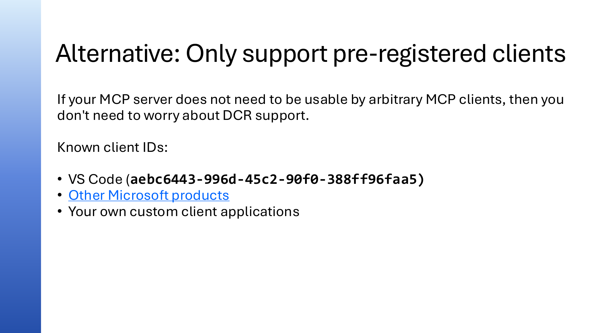
[Watch from 59:06](https://www.youtube.com/watch?v=_Redi3ChzFA&t=3546s)

If your MCP server does not need to be usable by arbitrary MCP clients, you can skip DCR entirely and use pre-registered client IDs. Known client IDs include:

- VS Code: `aebc6443-996d-45c2-90f0-388ff96faa5`
- Other Microsoft products
- Your own custom client applications

Pre-register these client IDs with your Entra app, and those clients can authenticate directly without needing DCR or CIMD support.

## Deploying Azure Function with pre-registration

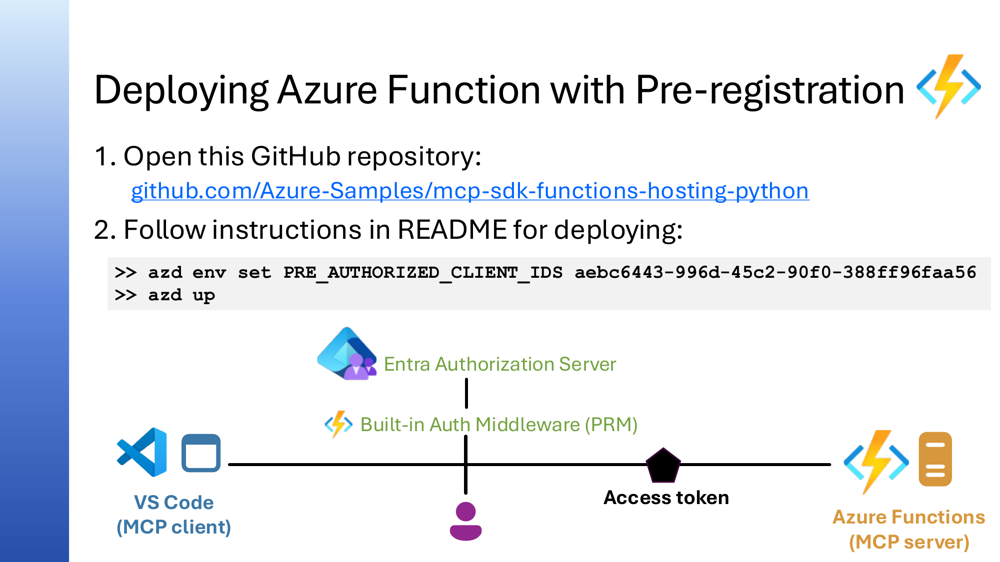
[Watch from 59:38](https://www.youtube.com/watch?v=_Redi3ChzFA&t=3578s)

The [mcp-sdk-functions-hosting-python](https://github.com/Azure-Samples/mcp-sdk-functions-hosting-python) repo supports deploying Azure Functions with pre-authorized client IDs:

```
azd env set PRE_AUTHORIZED_CLIENT_IDS aebc6443-996d-45c2-90f0-388ff96faa56
azd up
```

This creates an Azure Function with built-in auth middleware that handles PRM. VS Code (as the MCP client) authenticates through the Entra authorization server and receives an access token. The Azure Function validates the token and responds. No proxy or client registration database is needed because the client IDs are known in advance.

## Next steps

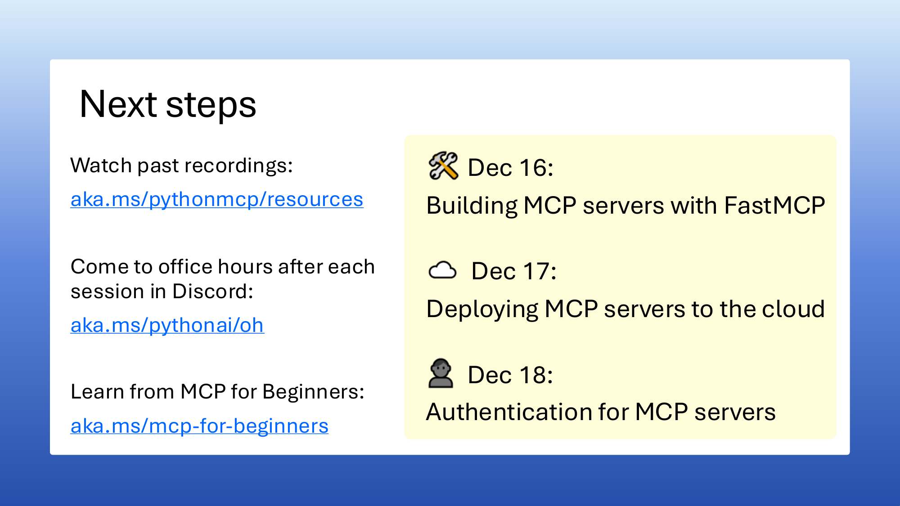
[Watch from 01:00:03](https://www.youtube.com/watch?v=_Redi3ChzFA&t=3603s)

- Watch past recordings: [aka.ms/pythonmcp/resources](https://aka.ms/pythonmcp/resources)
- Join office hours in Discord: [aka.ms/pythonai/oh](https://aka.ms/pythonai/oh)
- Learn from MCP for Beginners: [aka.ms/mcp-for-beginners](https://aka.ms/mcp-for-beginners)
- Download these slides: [aka.ms/pythonmcp/slides/auth](https://aka.ms/pythonmcp/slides/auth)
